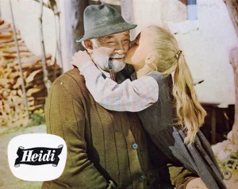
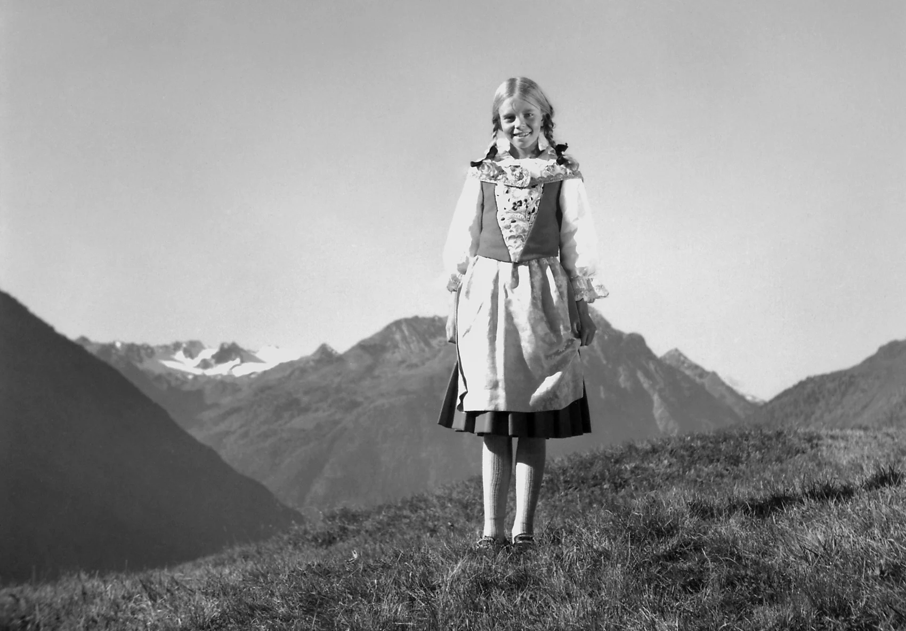
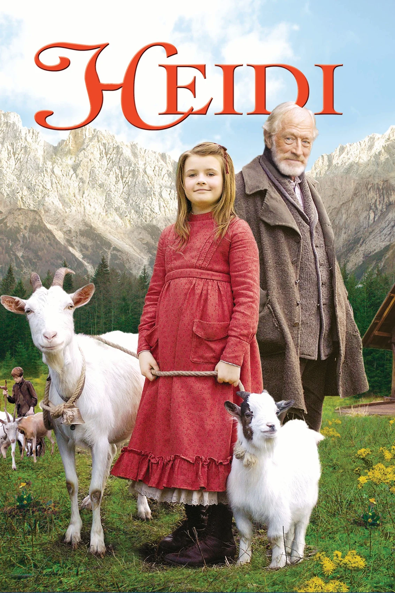
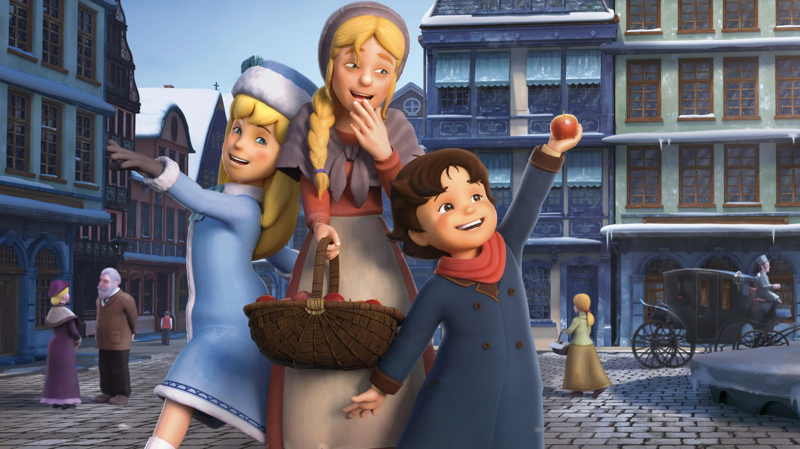
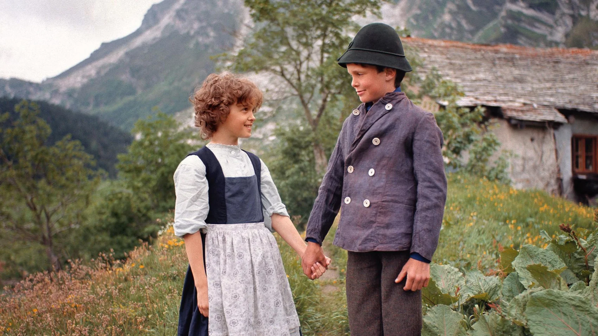
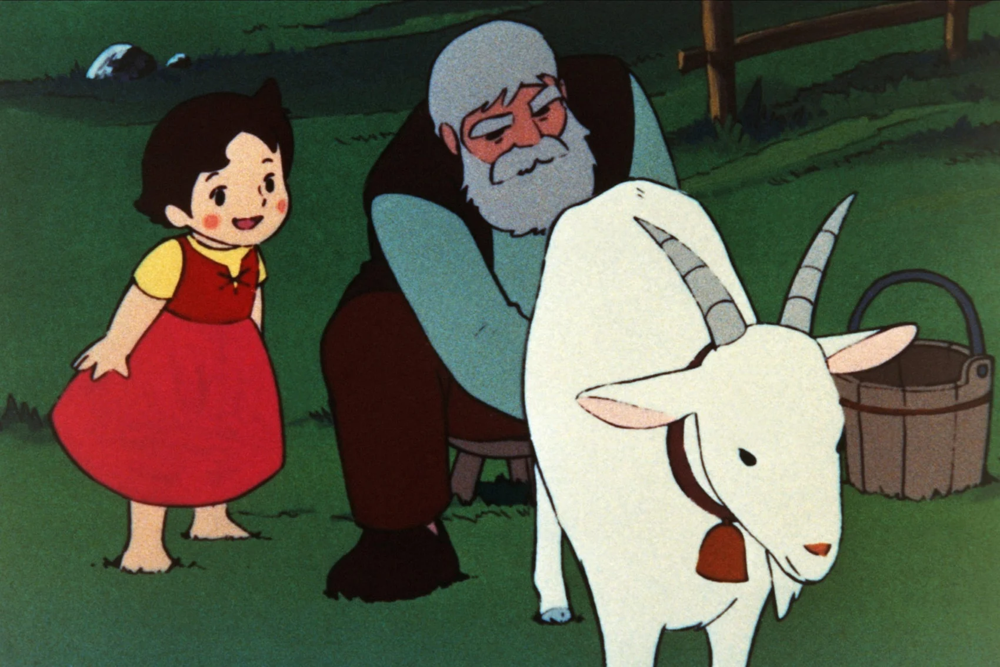
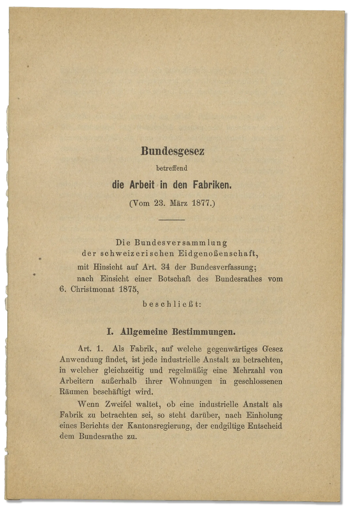
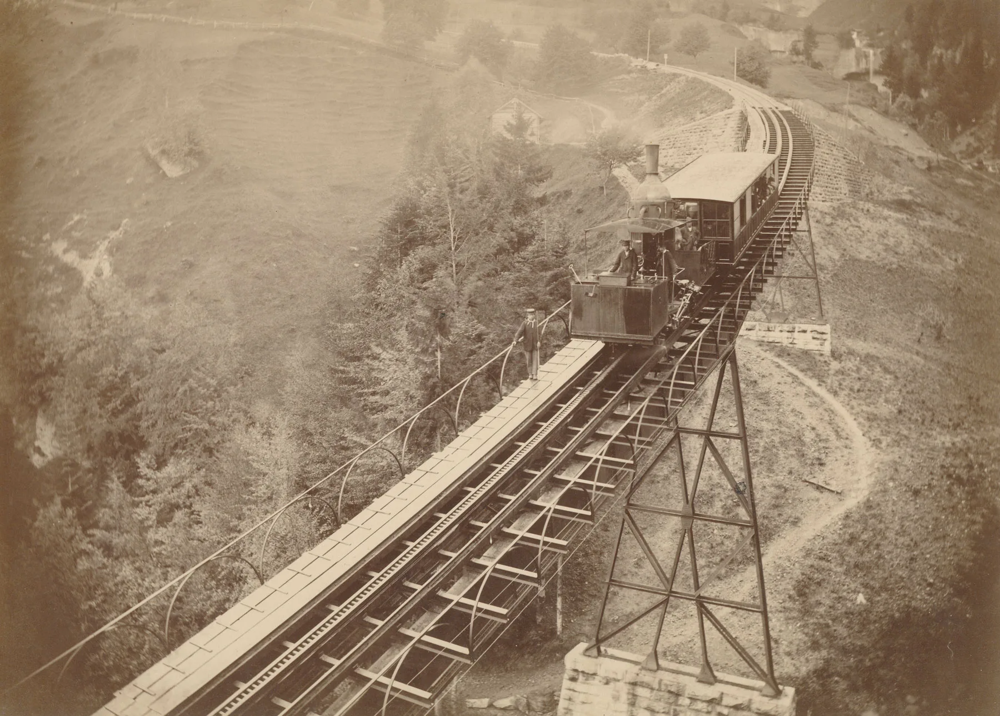

# Heidi · Individuelle Untersuchungen

Redaktion: 20. September 2026. Jede Frage hat einen eigenen Gegenstand, Materialort und Erwartungshorizont. Die Aufgaben dürfen nicht auf andere Filme oder Bilder übertragen werden. Bei frei gewählten, nicht redigierten Filmpaaren bleibt das Notizbuch ohne vorgefertigte Aufgabe.

## Peters Tat: Wir wissen mehr als Heidi

**Materialort:** Bereitgestelltes Fragment · 01:03–01:39 und 01:48–02:30; Zeiten ab Dateibeginn.

Der erste Abschnitt verbindet Peters Blick, einen erklärenden Zwischentitel und den Rollstuhl. Im zweiten kehren die anderen zum Haus zurück. Die englischen Textkarten gehören zum verfügbaren Fragment.

**Vorgehen:** Starte bei 01:03. Halte beim zerstörten Rollstuhl an. Starte danach bei 01:48 und lies Heidis Reaktion. Schreibe getrennt auf, was du über Peter weisst und was Heidi erst vermutet.

**Frage:** Warum ist Heidis Frage an Peter für das Publikum keine offene Täterfrage mehr? Was macht der Zwischentitel über Peters Rachepläne mit der Deutung der anschliessenden Tat?

Begründete Einordnung

Der Zwischentitel ordnet Peters Verhalten als geplante Rache ein: Klara nehme ihm Heidi weg. Danach sieht das Publikum den Umgang mit dem Rollstuhl und dessen zerstörten Zustand. Heidi kommt erst später hinzu. Ihre anschliessende Frage prüft eine Vermutung, während das Publikum schon Tat und Motiv verknüpfen konnte. Die Spannung liegt nun im Aufdecken und Eingestehen der Schuld. Der Text legt das Motiv deutlicher fest, als Peters Blick allein es könnte.

- [Universität Zürich: Timeline of Historical Film Colors, Prizma II](https://filmcolors.org/timeline-entry/1235/)

## Klara geht – aber die Rettung ist nicht vorbei

**Materialort:** AFI-Handlungsreferat · hier als Paraphrase; der eingebettete Film ist ein Trailer.

In der Fassung mit Shirley Temple kann Klara bereits in Frankfurt gehen. Rottenmeier will ihre Abhängigkeit erhalten. Der Grossvater sucht Heidi in der Stadt.

**Vorgehen:** Lege zwei kurze Handlungsketten an: Klaras neu gewonnene Beweglichkeit; Heidis Rettung durch den Grossvater. Verbinde in jeder Kette Person, Hindernis und Lösung.

**Frage:** Warum kann Klaras Gehfähigkeit diese Fassung nicht bereits abschliessen? Welche zusätzliche Spannung erzeugt Rottenmeiers Interesse an ihrer Abhängigkeit?

Begründete Einordnung

Klaras körperliche Entwicklung und Heidis sichere Rückkehr sind getrennte Probleme. Rottenmeiers Interesse macht Abhängigkeit zum zwischenmenschlichen Machtkonflikt; der suchende Grossvater trägt einen eigenen Rettungsbogen. Die Verlagerung des Gehens nach Frankfurt entkoppelt diese Entwicklung von einem notwendigen Aufenthalt auf der Alp.

- [American Film Institute: Heidi (1937)](https://catalog.afi.com/Film/4256-HEIDI)
- [Tomkowiak: Die Schweizer Heidi-Filme (2004), S. 205–222](quellen/Spyri_Lesarten.pdf#page=206)

## Ein Schweizer Film unter einem deutschen Titel

**Materialort:** Tomkowiaks Rezeptionsbefund und Produktionsangaben; kein Auftrag zu ungesehenen Szenen.

Der Film von Luigi Comencini wurde in Deutschland auch als «Sehnsucht nach der Heimat» verliehen. Die Handlung bleibt im 19. Jahrhundert; die Veröffentlichung erfolgte 1952.

**Vorgehen:** Schreibe zwei Vorschauen von je einem Satz: eine unter «Heidi», eine unter «Sehnsucht nach der Heimat». Verwende in beiden denselben Ortswechsel Alp–Frankfurt.

**Frage:** Welche Zuschauererfahrung rückt der zweite Titel in den Vordergrund, ohne die Handlung in die Nachkriegszeit zu versetzen?

Begründete Einordnung

Der zweite Titel macht den Verlust und das Verlangen nach einem vertrauten Ort zum Erwartungsrahmen. Ein Publikum nach dem Krieg konnte daran eigene Erfahrungen anschliessen. Das ist ein Rezeptionsangebot des Verleihtitels, kein Beleg dafür, dass Heidi im Film eine Kriegsvertriebene ist.

- [Tomkowiak: Die Schweizer Heidi-Filme (2004), S. 205–222](quellen/Spyri_Lesarten.pdf#page=206)
- [filmo: Heidi (1952)](https://www.filmo.ch/Edition/katalog/staffel-11/heidi.html)

## Heimkehr mit einem Beruf statt Rückkehr ins Kinderleben

**Materialort:** Charles Trittens Fortsetzungsroman: bibliografische Inhaltsbeschreibung der Open Library; BBC-Credits nennen Tritten als Vorlage und Joy Harington als Bearbeiterin.

Trittens Heidi besucht ein Internat in Lausanne. Sie möchte später in ihrem Dorf unterrichten und beim Grossvater und Peter leben. Die Fernsehadaption greift damit auf eine Fortsetzung eines anderen Autors zurück. Eine Kopie der BBC-Serie ist hier nicht belegt.

**Vorgehen:** Zeichne den Weg Alp → Internat → Dorf. Schreibe unter den letzten Ort zwei unterschiedliche Verben: «zurückkehren» und «unterrichten». Beschreibe, welche Voraussetzung das Internat für das zweite Verb schaffen kann.

**Frage:** Warum wird der Aufenthalt ausserhalb der Alpen hier nicht einfach als Irrweg zurückgenommen? Welche neue Verbindung zwischen Bildung, Selbstständigkeit und Heimat legt Heidis Berufswunsch an?

Begründete Einordnung

Die spätere Rückkehr soll Wissen und eine Tätigkeit ins Dorf bringen. Damit kann die Ausbildung ausserhalb der Heimat zu deren Zukunft beitragen, statt nur eine belastende Unterbrechung zu sein. Die Analyse betrifft die dokumentierte Romanvorlage. Wie die BBC diese Spannung inszeniert, ist daraus nicht abzulesen.

- [Open Library: Heidi Grows Up, Inhaltsbeschreibung der Romanvorlage](https://openlibrary.org/works/OL182106W/Heidi_grows_up)
- [BBC-Fortsetzung 1954: Vorlagen- und Bearbeitungscredits (IMDb)](https://www.imdb.com/title/tt0424139/fullcredits/)

## Wenn die Alp das Dorf bedroht

**Materialort:** SRF-Beschreibung der Sturm- und Überschwemmungssequenz in Heidi und Peter.

Die Fortsetzung von 1955 übernimmt zentrale Darstellende des Films von 1952. Eine aufwendig inszenierte Überschwemmung gefährdet die Dorfgemeinschaft.

**Vorgehen:** Ordne zwei Konflikte nebeneinander: Klaras Entwicklung und die Überschwemmung. Benenne für jeden, wer betroffen ist und welche Art von Handeln eine Lösung verlangt.

**Frage:** Was verändert die Überschwemmung am Modell der heilsamen Bergwelt, wenn nun eine ganze Gemeinschaft statt eines einzelnen Kindes gefährdet ist?

Begründete Einordnung

Die Natur erhält neben ihrer wohltuenden Funktion eine bedrohliche. Der Katastrophenkonflikt vergrössert die Zahl der Betroffenen und ermöglicht gemeinsame Rettungshandlungen. Er wiederholt Klaras Entwicklung nicht, sondern ergänzt sie um einen kollektiven Höhepunkt.

- [SRF: Heidi und Peter (1955)](https://www.srf.ch/kultur/film-serien/film-serien-heidi-und-peter-1955)
- [Tomkowiak: Die Schweizer Heidi-Filme (2004), S. 205–222](quellen/Spyri_Lesarten.pdf#page=206)

## Etikette im Takt: Gehorsam wird aufführbar

**Materialort:** Dokumentierte Liedtitel des NBC-Musicals: I Got My Way und The Etiquette Song; TheTVDB-Sendungsverzeichnis.

Die Liedliste stellt einen behaupteten eigenen Willen («I Got My Way») neben gesellschaftliche Umgangsregeln («The Etiquette Song»). Die Rollenverteilung dieser Nummern ist durch die Liste allein nicht belegt.

**Vorgehen:** Sprich «Ich habe meinen Willen bekommen» zunächst frei, dann im gleichen, streng wiederholten Takt wie drei von dir formulierte Tischregeln für den Sesemann-Haushalt. Notiere, welche Version Eigenwillen hörbar lässt. Dies ist ein eigenes Inszenierungsexperiment, keine Rekonstruktion der Nummern.

**Frage:** Was könnte eine Musicaladaption mit dem Konflikt zwischen Heidis Eigenwillen und gesellschaftlicher Einordnung tun, wenn die Regeln selbst zur eingängigen Nummer werden? Wann würde der musikalische Spass die Disziplinierung verdecken, wann sie entlarven?

Begründete Einordnung

Ein regelmässiger gemeinsamer Takt kann Einordnung körperlich erfahrbar und zugleich unterhaltsam machen. Eine eigensinnige Abweichung könnte den Konflikt hörbar halten. Ob daraus Zustimmung oder Spott entsteht, hängt etwa von Betonung und Übertreibung ab. Die Liedtitel eröffnen diesen begrenzten Versuch; sie belegen nicht, wer die Nummer singt oder wie sie tatsächlich gespielt wurde.

- [TheTVDB: Max Liebman Presents, Liedliste zu Heidi (1955)](https://thetvdb.com/series/max-liebman-presents/allseasons/official)
- [Paley Center: Max Liebman Presents: Heidi, 1.10.1955](https://www.paleycenter.org/collection/item?item=B%3A29624)

## Gute Absichten, fremde Entscheidungen

**Materialort:** Handlungsreferate zu A Gift for Heidi bei Rotten Tomatoes und IMDb, nicht der kurze eingebettete Filmanfang.

Heidi meldet Peter gegen seinen Willen zu einem Gesangswettbewerb an. Später helfen die Kinder bei der Rettung eines in den Bergen eingeschlossenen Paares; auch die US-Armee wird eingeschaltet.

**Vorgehen:** Stelle die beiden Hilfsaktionen gegenüber: Peter soll auftreten; das Paar soll aus einer Gefahr gerettet werden. Notiere jeweils, wessen Ziel verfolgt wird und wer in die Entscheidung einwilligen kann.

**Frage:** Wieso kann «Heidi hilft» die Rettung plausibel beschreiben, Peters Anmeldung aber zugleich beschönigen? Wie verändert die eingeschaltete Armee den Massstab kindlicher Handlungsmacht?

Begründete Einordnung

Beim Wettbewerb setzt Heidi ihren Plan über Peters geäusserten Willen. Bei der Rettung steht die Abwendung einer akuten Gefahr im Vordergrund. Auch dort leisten die Kinder nicht alles selbst: Institutionelle Hilfe erweitert ihre Handlungsmöglichkeiten. Die Unterscheidung verhindert, dass gute Absicht automatisch jede Form des Eingreifens rechtfertigt.

- [IMDb: A Gift for Heidi, ausführliches Handlungsreferat](https://www.imdb.com/title/tt0051656/plotsummary/)
- [Rotten Tomatoes: A Gift for Heidi, redaktionelle Synopsis](https://www.rottentomatoes.com/m/a_gift_for_heidi)

## Baby Naaz arbeitet, während Poornima Kind ist

**Materialort:** Michael Lawrence: Hindianizing Heidi, öffentliches Abstract, letzter Satz über die Arbeit der Kinderdarsteller.

Lawrence untersucht Do Phool als Bearbeitung im Hindi-Kino der 1950er-Jahre. Sein Abstract schlägt vor, die Arbeit der Kinderdarsteller zu beachten: Dadurch wird sichtbar, wie ein Film Vorstellungen von Kindheit herstellt. Untersucht wird diese Forschungsthese, nicht eine ungesehene Szene.

**Vorgehen:** Lege zwei Spalten an: Poornima als erzählte Figur und Baby Naaz als Darstellerin. Ordne «eine Rolle einüben», «im Bild spontan wirken» und «als unschuldiges Kind erscheinen» zu; begründe eine mögliche Doppelzuordnung.

**Frage:** Wie kann Baby Naaz durch erlerntes Spiel den Eindruck von Poornimas ungekünstelter Kindlichkeit erzeugen? Welche Ebene blendet die Aussage «Das Kind ist einfach natürlich» aus?

Begründete Einordnung

Eine scheinbar spontane Figur kann Ergebnis professioneller Darstellungsarbeit sein. Die Wirkung auf der Leinwand und die Tätigkeit vor der Kamera gehören auf verschiedene Ebenen. Lawrence fordert, diese Arbeit in die Analyse des Hindi-Kinos einzubeziehen. Das Abstract belegt weder einen bestimmten Probenablauf noch Baby Naaz’ persönliche Arbeitsbedingungen.

- [Michael Lawrence: Hindianizing Heidi (Abstract, Adaptation 5/1, 2012)](https://academic.oup.com/adaptation/article-abstract/5/1/102/6836?login=true)
- [IMDb: Do Phool (1958), Besetzung und Vorlage](https://www.imdb.com/title/tt0231474/fullcredits/)

## Home Again ist noch nicht Happy Ending

**Materialort:** Episodenverzeichnis der BBC-Fassung von 1959: Titel der sechs wöchentlichen Teile.

Die Reihenfolge lautet: Up the Mountain → Two Visitors → Away from Grandfather → Another Grandmother → Home Again → Happy Ending. Die Titel sind Paratexte, keine vollständigen Inhaltsangaben.

**Vorgehen:** Übertrage die sechs Titel auf eine Linie. Verbinde «Away from Grandfather» mit «Home Again». Kreise danach «Another Grandmother» ein: Hier benennt ein Titel eine neue Beziehung statt eines Ortes.

**Frage:** Was verspricht die zusätzliche Folge nach «Home Again» über den Unterschied zwischen räumlicher Heimkehr und erzählerischem Abschluss? Wie könnte die dazwischengeschaltete Grossmutter dieses Rückkehrmuster verändern?

Begründete Einordnung

Die Titelabfolge lässt die Heimkehr vor dem ausdrücklich angekündigten Abschluss stattfinden. Damit wird Rückkehr nicht automatisch mit der Auflösung aller Beziehungen gleichgesetzt. «Another Grandmother» setzt eine neue Bezugsperson zwischen Trennung und Heimkehr. Welche Konflikte sie tatsächlich löst, bleibt ohne Inhaltsnachweis offen; die Titel lenken zunächst die Erwartung.

- [Heidi 1959: Episodentitel und Sendereihenfolge (IMDb)](https://www.imdb.com/title/tt1591533/episodes/)
- [BBC Programme Index: Heidi, Up the Mountain, 19.5.1959](https://genome.ch.bbc.co.uk/8d3dbd53d8d342b2aa9d0de3d07487e3)

## Der Kuss verkürzt eine schwierige Annäherung

**Materialort:** DFF-Bild zu Heidi (1965), unten eingeblendet; dazu die DFF-Inhaltsangabe über den anfangs griesgrämigen Grossvater.

Heidi umfasst den sitzenden Grossvater und küsst ihn seitlich am Gesicht. Seine Augen sind gesenkt; sein Mund wirkt gelöst. Die Inhaltsangabe beschreibt dagegen zunächst Distanz und erst später gewonnene Zuneigung.

**Vorgehen:** Decke zunächst Heidis Gesicht und Arme im Bild ab. Beschreibe den verbleibenden Grossvater. Decke sie wieder auf und prüfe, welche deiner Beschreibungen sich allein durch den Körperkontakt verändert.

**Frage:** Wie macht dieses Werbebild aus einer zeitlichen Entwicklung bereits einen sichtbaren Beziehungszustand? Was muss eine Filmhandlung noch erzählen, das der Kuss als Bild schon voraussetzt?

Begründete Einordnung

Das Bild bündelt körperliche Nähe in einer einzigen Geste. Die Arme um den Grossvater und der Kuss können seine zurückgenommene Haltung als angenommene Zuwendung lesbar machen. Der beschriebene Weg von anfänglicher Verschlossenheit zu diesem Vertrauen fehlt im Einzelbild. Ein Werbemotiv kann den erreichten Zustand vorwegnehmen, bevor das Publikum den Übergang kennt.

- [DFF / filmportal: Heidi (1965)](https://www.filmportal.de/film/heidi_3433dc9200b04cc4923fcb3f7863320c)

## Ein Kind vor Bergen – aber ohne Gegenüber

**Materialort:** Veröffentlichtes NBC/Getty-Motiv mit Jennifer Edwards, unten eingeblendet; Untersuchung dieses Bildes, nicht einer Filmszene.

Heidi steht nahezu frontal im Bildzentrum. Ihr ganzer Körper ist zu sehen; hinter ihr liegen weit entfernte Berge. Keine andere Figur erscheint, zu der sie eine sichtbare Beziehung aufnehmen könnte.

**Vorgehen:** Betrachte zuerst nur die Figur, dann das ganze Bild. Vergleiche den Blick zum betrachtenden Publikum mit der fehlenden Blickbeziehung zu einer zweiten Figur im dargestellten Raum.

**Frage:** Wie wird Heidi hier zur Repräsentantin einer Alpenwelt, obwohl das Bild keine Tätigkeit in dieser Welt zeigt? Welche Beziehung verspricht die frontale Präsentation dem Publikum statt einer Beziehung innerhalb der Handlung?

Begründete Einordnung

Die Berge ordnen Heidi einer wiedererkennbaren Landschaft zu. Frontalität, Ganzfigur und zentrale Stellung präsentieren sie dem Publikum. Anders als etwa ein Bild des Melkens braucht dieses Motiv kein konkretes Tun, um Zugehörigkeit anzubieten. Es entwirft eine Begegnung mit der Hauptfigur; eine konkrete Handlung oder ein Blickwechsel innerhalb der Szene ist daraus nicht abzuleiten.

- [Bibliothekskatalog SEKnFIND: Heidi, NBC-Fernsehfassung (1968)](https://www.seknfind.org/cgi-bin/koha/opac-detail.pl?biblionumber=662102)

## Wenn Peter den Rollstuhl nicht absichtlich zerstört

**Materialort:** Takahatas Werkbericht, gedruckte S. 202–203 (PDF-Seiten 203–204) · Paraphrase seines Eingriffs.

Takahata erklärt: Im Anime beschädigt Klara ihren Rollstuhl versehentlich selbst, als ihre Entschlossenheit zum Gehen nachlässt. Peter ist damit nicht der eifersüchtige Täter. Der hier eingebettete Bergtraum-Clip zeigt diesen Rollstuhlvorfall nicht.

**Vorgehen:** Stelle der bewussten Tat im Fragment von 1920 diese dokumentierte Änderung gegenüber. Streiche aus der 1920er Handlungskette das Glied «Peter plant Rache».

**Frage:** Welche Frage an Peter verliert damit ihre Grundlage – und weshalb bedeutet das noch nicht, dass Klaras Schwierigkeiten im Anime verschwinden?

Begründete Einordnung

Die Schuldfrage «Warum hast du ihr das angetan?» gegenüber Peter setzt seine absichtliche Tat voraus; diese entfällt. Stattdessen verbindet Takahata den Unfall mit Klaras schwankender Entschlossenheit. Er beschreibt, dass der Anime bis zu ihrem Gehen mehr Zeit auf Freundschaft und ihre Gefühle verwendet. Die Spannung verlagert sich damit vom Aufdecken und Vergeben einer Tat auf die Entwicklung von Mut und Unterstützung.

- [Takahata: Making of the TV Series (2004), S. 189–204](quellen/Spyri_Lesarten.pdf#page=190)

## Die Regie wechselt mit dem Ort

**Materialort:** SRF-Produktionsbericht zur Serie mit Katia Polletin und René Deltgen.

Toni Flaadt inszenierte die ersten elf Folgen. Joachim Hess verantwortete zehn Frankfurter Folgen und fünf Folgen der Rückkehr. Der eingebettete Vorspann ist keine vollständige Episode.

**Vorgehen:** Lege die drei Blöcke auf eine Linie: 11 → 10 → 5. Trage Alp, Frankfurt und Rückkehr sowie die zuständige Regie ein.

**Frage:** Wie verhindert diese Aufteilung die vorschnelle Behauptung, jeder Unterschied zwischen Alp und Frankfurt sei allein durch den Schauplatz verursacht?

Begründete Einordnung

Ort, Position im Erzählbogen und Regiezuständigkeit verändern sich nicht unabhängig voneinander. Ein beobachteter Stilunterschied könnte mehrere Ursachen haben. Die Rückkehr unter derselben Regie wie Frankfurt wäre ein geeigneter zusätzlicher Vergleich; der Vorspann allein kann ihn nicht leisten.

- [SRF-Chronik: Serienstart am 13. September 1978](https://medien.srf.ch/documents/20142/3708308/13._September_1978-Start_der_26-teiligen_Serie__Heidi_.pdf/65527ef3-59ad-c948-3c82-14f499717d5f?t=1548925423965)

## Im Duett zusammen – noch nicht im Einklang

**Materialort:** Ralph Senenskys Regiebericht, Abschnitt unmittelbar nach dem fünften eingebetteten Clip: getrennt aufgenommene Gesangspartien und «Amen».

Senensky berichtet von getrennten Aufnahmen des Duetts. Der Schnitt brachte Heidi und den Grossvater rhythmisch nicht völlig zusammen. Der Regisseur akzeptierte dies als Ausdruck ihrer Uneinigkeit; beim «Amen» seien sie vereint.

**Vorgehen:** Klopfe zwei leicht versetzte Rhythmen und führe sie erst bei einem gemeinsamen Schlusswort zusammen. Übertrage den Unterschied auf Heidis Verhältnis zum Grossvater in der beschriebenen Nummer.

**Frage:** Warum kann der zunächst erwogene technische «Fehler» hier dramaturgisch nützlicher sein als perfekter Gleichklang? Was verändert das gemeinsame Schlusswort an der Beziehung?

Begründete Einordnung

Versetzter Gesang lässt gemeinsame Anwesenheit und fehlende Übereinstimmung gleichzeitig hörbar werden. Das gemeinsame Schlusswort schafft einen begrenzten Moment der Verbindung. Die Deutung ist in Senenskys rückblickendem Bericht verankert; sie beweist nicht, dass jedes Publikum sie bemerkt.

- [Ralph Senensky: eigener Produktionsbericht mit Ausschnitten](https://ralph-senensky.blogspot.com/2010/08/new-adventures-of-heidi-june-july-1978.html)

## Die Eule holt Hilfe, die Ziegen brechen das Fenster auf

**Materialort:** AFI-Synopse zu Heidi’s Song: Absatz nach der Entdeckung der Kätzchen, Keller und Befreiung.

Rottenmeier sperrt Heidi nach dem Fund der Kätzchen in den Keller. Die Eule Hootie verständigt Peter in den Bergen. Peter, Spritz und weitere Ziegen öffnen gewaltsam das Kellerfenster und befreien Heidi. Klara entscheidet sich mitzureisen. Das ist eine Paraphrase der AFI-Synopse.

**Vorgehen:** Zeichne die Hilfskette Keller → Eule → Peter und Ziegen → Fenster → gemeinsame Abreise. Streiche probeweise die Eule: An welcher Stelle bricht die Kette, obwohl Peter helfen könnte?

**Frage:** Wie verwandelt diese Tier-Helferkette Heidis Rückkehr in eine Befreiungsaktion? Was trägt Klaras Entscheidung zur Abreise bei, das ein blosses Gerettetwerden nicht leisten würde?

Begründete Einordnung

Tiere transportieren Wissen und ermöglichen die Flucht; sie sind Handlungsträger statt Landschaftsschmuck. Der Keller macht Heidis Lage zu einer äusseren Gefangenschaft. Klara schliesst sich aus eigenem Entschluss an: Die Befreiung führt zur gemeinsamen Bewegung der Kinder. Ohne Hooties Nachricht fehlt in dieser Kette die Verbindung zwischen Stadt und Bergen.

- [AFI: Heidi’s Song (1982)](https://catalog.afi.com/Catalog/moviedetails/56792)

## Die Vertriebsnachbarschaft macht Heidi zur Glaubenslektion

**Materialort:** Vision Video, Sommerkatalog 2011: Abschnitt Great Bible Discovery (6–12), drei Kurzbeschreibungen.

Im selben Katalogblock stehen ein BMX-Konflikt mit dem Auftrag zur Feindesliebe, Climb a Tall Mountain mit Heidi, Peter, Hans und einem Holzschnitzer sowie eine Geschichte, die Gottes Liebe an die Stelle der Fäuste setzt.

**Vorgehen:** Schreibe zuerst eine Programmankündigung für Climb a Tall Mountain allein. Ergänze dann die beiden Nachbarfilme. Markiere das neue gemeinsame Deutungswort, das deine zweite Ankündigung bestimmt.

**Frage:** Wie lenkt die Zusammenstellung die Erwartung an Heidis Konflikte, noch bevor eine Szene zu sehen ist? Was würde ein Publikum nach dieser Rahmung eher als gelungene Lösung erkennen: Sieg über einen Gegner oder veränderten Umgang mit ihm?

Begründete Einordnung

Die Nachbarschaft verbindet die Alpenhandlung mit Beispielen für Feindesliebe und Verzicht auf Gewalt. Dadurch wird eine Lösung als moralische Veränderung erwartbar. Das ist eine untersuchbare Entscheidung des Vertriebs und noch kein Beleg für jede einzelne Szene. Derselbe Film könnte in einem anderen Programm anders angekündigt werden.

- [Vision Video: Sommerkatalog 2011, Great Bible Discovery (6–12)](https://www.visionvideo.com/files/MC11.pdf)

## Heidi wird 1915 zur Flüchtenden

**Materialort:** AFI-Handlungs- und Produktionsangaben zu Courage Mountain.

Veröffentlichung 1990, Dreharbeiten 1988, erzählte Zeit 1915. Die jugendliche Heidi gerät aus einem Internat in Krieg und Flucht.

**Vorgehen:** Baue eine Zeile mit drei getrennten Feldern: hergestellt · veröffentlicht · spielt in. Ergänze darunter: Wer muss in einer Fluchtgeschichte handeln, damit die Gruppe weiterkommt?

**Frage:** Was verändert die Kriegssituation am Rückkehrmotiv, wenn Heidi als Jugendliche handeln muss und das Verlassen eines Ortes nicht nur Heimweh bedeutet?

Begründete Einordnung

Krieg macht Ortswechsel zur Frage von Gefahr, Schutz und Überleben. Die jugendliche Figur kann Entscheidungen für Flucht und andere Menschen tragen. Das erweitert die kindliche Rückkehrgeschichte um einen Abenteuer- und Bewährungsbogen. 1915 bezeichnet dabei die erzählte Welt, nicht das Entstehungsjahr des Films.

- [AFI: Courage Mountain (1990)](https://catalog.afi.com/Film/58458-COURAGE-MOUNTAIN)

## Heidi im Museum statt im Familienprogramm

**Materialort:** Werkzuordnung des Whitney Museum und Beschreibung der Sammlung Goetz.

Mike Kelley und Paul McCarthy verwenden Heidi 1992 als Material einer Videoarbeit. Die Sammlung Goetz beschreibt eine subversive Neuinterpretation. Das Museum ist ein anderer Präsentationsrahmen als ein Kinderfilmprogramm.

**Vorgehen:** Formuliere zwei Erwartungssätze an denselben Titel: für ein Familienprogramm und für eine Ausstellung mit Kelley/McCarthy. Kennzeichne, welche Erwartung der Begriff «subversiv» irritiert.

**Frage:** Warum kann die Vertrautheit von Familie und Alpenidylle Voraussetzung der Störung sein, statt deren Gegenteil?

Begründete Einordnung

Eine bekannte Idylle liefert einen Erwartungsrahmen, dessen Verletzung bemerkbar wird. Der Ausstellungskontext kann diesen Bruch als Untersuchung kultureller Bilder ankündigen. «Subversiv» ist zunächst die kuratorische Deutung; sie muss bei einer Werkbetrachtung konkret begründet werden.

- [Whitney Museum: Mike Kelley / Paul McCarthy, Heidi (1992)](https://whitney.org/collection/works/34266)
- [Sammlung Goetz: Heidi, Kelley / McCarthy](https://online.sammlung-goetz.de/en/work/heidi-mike-kelley-paul-mccarthy/)

## Zwei Teile brauchen nicht dieselbe Spannung

**Materialort:** Disney-D23-Angabe zur zweiteiligen Miniserie ab 18. Juli 1993.

Noley Thornton spielt Heidi, Jason Robards den Grossvater, Jane Seymour Rottenmeier. Die Auswertung als zweiteilige Miniserie unterbricht den Gesamtbogen mindestens einmal. Der Heimvideo-Trailer zeigt keine verlässlich markierte Teilgrenze.

**Vorgehen:** Entwirf zwei verschiedene mögliche Unterbrechungen: vor Heidis Ankunft in Frankfurt oder vor ihrer Rückkehr. Formuliere für jede genau die Frage, mit der ein Publikum warten würde.

**Frage:** Weshalb erzeugen diese beiden vorgeschlagenen Teilgrenzen unterschiedliche Erwartungen, obwohl keine zusätzliche Figur erfunden wird?

Begründete Einordnung

Vor Frankfurt ist die neue Lebenswelt unbekannt; vor der Rückkehr steht die Wiederbegegnung mit dem verlorenen Zuhause bevor. Dieselben Figuren tragen so verschiedene offene Fragen. Beide Unterbrechungen sind hier Entwürfe, keine Behauptungen über die tatsächliche Schnittgrenze der Miniserie.

- [Disney D23: Heidi (television), 1993](https://d23.com/a-to-z/heidi-television/)

## This Is Home: ein Ort wird besungen

**Materialort:** Jetlag-Animationsfilm · eingebettete Musikszene This Is Home, 2:41.

Die Musikszene gehört zur eigenständigen Jetlag-Fassung von 1995. «Home» ist eine Bezeichnung von Zugehörigkeit; sie nennt noch keine konkreten Beziehungen.

**Vorgehen:** Höre auf die Verbindung des gesungenen «home» mit dem gleichzeitig sichtbaren Bild. Halte einen solchen Moment samt Zeitposition an und benenne die Person oder den Ort im Bild.

**Frage:** Wie konkretisiert die Verbindung von Lied und Bild, was «Zuhause» für diese Szene meint? Was ginge verloren, wenn nur der Liedtitel angezeigt würde?

Begründete Einordnung

Der Titel setzt ein Thema. Erst seine Verbindung mit den Bildern kann den Begriff an bestimmte Personen, Tätigkeiten oder Räume binden. Eine Bildbeobachtung und ihr Zeitcode sind deshalb mehr als die Übersetzung «Das ist Zuhause». Die Szene belegt die Jetlag-Fassung, nicht Takahatas Anime.

- [IMDb: Heidi (1995), Jetlag-Fassung](https://www.imdb.com/title/tt0213709/)

## Berlin ersetzt Frankfurt – das Netz verkürzt die Entfernung

**Materialort:** Porta-Cultura- und SWI-Befunde zur Gegenwartsfassung von Markus Imboden.

Berlin tritt an die Stelle des historischen Frankfurt. Peter lebt in einer Welt von Bike und Internet. Cornelia Gröschel spielt Heidi.

**Vorgehen:** Entwirf eine Nachricht, die Peter Heidi in Berlin schicken könnte. Schreibe danach genau einen Satz, welches Hindernis die Nachricht überwindet und welches sie nicht beseitigt.

**Frage:** Warum kann unmittelbarer Kontakt Heidis Trennung verändern, ohne ihre Rückkehr oder ihre Zugehörigkeit überflüssig zu machen?

Begründete Einordnung

Eine Nachricht kann Information und Austausch über die Entfernung ermöglichen. Sie hebt weder die räumliche Trennung noch fremde Regeln im Haushalt automatisch auf. Modernisierung verändert damit konkrete Handlungsmöglichkeiten, statt nur alte Kleidung gegen neue Geräte auszutauschen. Die Nachricht ist ein eigener Entwurf.

- [Kantonsbibliothek Graubünden / Porta Cultura: Heidi (2001)](https://portacultura.gr.ch/records/AVGR6945)
- [SWI swissinfo: Up-to-date Heidi (29. März 2001)](https://www.swissinfo.ch/eng/culture/up-to-date-heidi-seen-on-swiss-cinema-screens/1961694)

## Die Ziege an Heidis Seil, Peter im Hintergrund

**Materialort:** Covermotiv zum Realfilm mit Emma Bolger und Max von Sydow, unten eingeblendet.

Heidi steht gross im Vordergrund und hält ein Seil zur Ziege. Der Grossvater steht hinter ihr. Peter ist als kleine Figur mit weiteren Tieren links hinten sichtbar. Heidi und der Grossvater blicken nach vorn.

**Vorgehen:** Verfolge das Seil von Heidis Händen zur Ziege. Vergleiche diese konkrete Verbindung mit dem Grössenunterschied zwischen Heidi und Peter. Halte Bildposition und Figurenrolle getrennt fest.

**Frage:** Wie verbindet das Cover Heidis Vorrang mit alltäglicher Verantwortung, während Peter trotz seiner Beziehung zu den Ziegen an den Rand tritt? Warum darf diese Rangordnung nicht als messbarer Handlungsanteil im Film gelten?

Begründete Einordnung

Das Seil verknüpft Heidi mit einer praktischen Tätigkeit, die grosse Vordergrundfigur macht sie zugleich zum Blickzentrum. Peter bleibt als kleineres Element der Alpenwelt sichtbar. Die Komposition kann eine Hierarchie der Wiedererkennung anbieten, ohne die tatsächliche Verteilung von Entscheidungen, Szenen oder Redezeit zu zählen.

- [Common Sense Media: Heidi (2005), Filmangaben](https://www.commonsensemedia.org/movie-reviews/heidi-2005)

## Wer muss sich verändern, damit Heidi ankommt?

**Materialort:** DFF-Inhaltsangabe zum Zeichentrickfilm von Alan Simpson, Abschnitt «Inhalt».

Die DFF-Beschreibung lässt Heidi sich zunächst unwohl fühlen. Peter wird ihr Freund. Danach gewinnt sie die Zuneigung des zurückgezogenen Grossvaters. Die Ankunft wird damit als Folge veränderter Beziehungen zusammengefasst.

**Vorgehen:** Ordne die drei Zustände «unwohl in fremder Umgebung», «Freundschaft mit Peter», «Zuneigung des Grossvaters» auf einer Linie. Schreibe darunter, bei wem jeweils eine Veränderung vorausgesetzt wird.

**Frage:** Warum erzählt diese Zusammenfassung das Ankommen nicht bloss als Anpassung des Kindes? Welche zusätzliche Veränderung wird dem Grossvater zugemutet, wenn aus Unterbringung ein Zuhause werden soll?

Begründete Einordnung

Heidi muss eine neue Umgebung erschliessen, findet mit Peter aber auch eine Beziehung, die sie trägt. Die Zuneigung des Grossvaters verlangt zusätzlich, dass dessen Rückzug durchlässig wird. So erscheint Ankommen als wechselseitiger Prozess. Die knappe Inhaltsangabe belegt diese Gewichtung der Zusammenfassung, nicht die Dauer einzelner Szenen.

- [DFF / filmportal: Heidi (2004/2005), Alan Simpson](https://www.filmportal.de/film/heidi_24a1ad0d0348473b971042ec1b19b8dc)

## Schule lässt sich nicht wie Frankfurt verlassen

**Materialort:** Produktionsbefund zur Jugendserie Heidi & Co.: Gegenwart, Schule und neue Freundschaften; abgegrenzter eigener Szenenentwurf.

Der schulische Alltag stellt Gleichaltrige wiederholt zusammen. Im hier zu erprobenden Konflikt soll Heidi für Peter Partei ergreifen, würde damit aber eine neue Klassenfreundin öffentlich beschuldigen. Diese Situation ist ein eigener Versuch, keine behauptete Serienepisode.

**Vorgehen:** Schreibe zwei Äusserungen Heidis im Klassenzimmer: eine öffentlich vor allen, eine spätere unter vier Augen. Lasse beide Beziehungen nach dem Gespräch weiterbestehen; niemand darf einfach wegziehen.

**Frage:** Welche Spannung entsteht, weil Heidi zugleich Loyalität zu Peter und einen Platz in der neuen Gruppe behalten möchte? Was kann das vertrauliche Gespräch lösen, das der öffentliche Satz verschärft?

Begründete Einordnung

Eine öffentliche Parteinahme verändert auch die Stellung vor der Gruppe. Unter vier Augen kann Heidi Gründe erfragen, ohne die andere Person sofort vor Publikum festzulegen. Das Experiment nutzt die wiederkehrende Schule: Die Beteiligten müssen einander weiterhin begegnen. Eine Lösung muss deshalb mit den Folgen für beide Bindungen rechnen.

- [AlloCiné: Heidi, Staffel und Episoden (2007)](https://www.allocine.fr/series/ficheserie-3766/saison-6780/)

## Wer spricht: Hund oder Heidi?

**Materialort:** Trailer zu Heidi 4 Paws: A Furry Tale.

Hunde übernehmen die Rollen; menschliche Stimmen geben ihnen Figurenrede. Der Rollenname gehört zur Erzählung, der sichtbare Körper bleibt ein Tierkörper.

**Vorgehen:** Wähle im Trailer einen Moment mit einem Hund und Figurenrede. Spiele ihn stumm ab und dann erneut mit Ton. Notiere getrennt die sichtbare Bewegung und die Aussage der Stimme.

**Frage:** Welche Absicht schreibst du dem Hund erst durch die menschliche Stimme zu – und was lässt sich allein an seiner Bewegung erkennen?

Begründete Einordnung

Synchronisierte Rede kann eine Bewegung als Zustimmung, Wunsch oder Widerspruch rahmen. Der stumme Durchgang zeigt, wie viel davon im Tierkörper selbst erkennbar ist. Man muss dem Tier deshalb nicht dieselbe bewusste Darstellung zuschreiben wie der gesprochenen Figur.

- [WTTW: Jahresbericht 2008, Heidi 4 Paws](https://www.wttw.com/sites/default/files/2008-WTTW-WFMT-Annual-Report.pdf)

## Lesen ist noch nicht selbst erzählen

**Materialort:** Unterrichtsmaterial zum Gsponer-Realfilm; ergänzend die lokale Buchaufnahme ab 45:00.

Das Begleitmaterial hebt Heidis Wunsch hervor, Geschichten zu schreiben. Im Schnittlabor ist die Aufnahme einer Buchseite bei 45:00 verfügbar. Eine gefilmte Buchseite allein beweist noch keinen eigenen Schreibwunsch.

**Vorgehen:** Formuliere zwei unterschiedliche Ziele: eine vorhandene Geschichte lesen können; eine eigene Geschichte verfassen wollen. Ordne die Buchaufnahme nur dem zu, was sie tatsächlich zeigt.

**Frage:** Wie verändert der Wunsch zu schreiben Heidis Zukunftsperspektive gegenüber einer Geschichte, deren Ziel allein die Rückkehr nach Hause wäre?

Begründete Einordnung

Rückkehr stellt Zugehörigkeit wieder her. Selbst schreiben zu wollen eröffnet zusätzlich ein eigenes zukünftiges Handeln: Heidi kann Geschichten gestalten, statt nur Gegenstand einer erzählten Geschichte zu sein. Dieser Befund stammt aus dem Begleitmaterial; das einzelne Buchbild macht ihn nicht schon sichtbar.

- [Stiftung Lesen: Unterrichtsmaterial zu Heidi (2015)](https://www.stiftunglesen.de/fileadmin/Schulportal/06_Lehrmaterial/02_Materialien_zur_Filmbildung/30_HEIDI/HEIDI_final_D_02.pdf)
- [SWISS FILMS: Heidi (2015)](https://www.swissfilms.ch/de/movie/heidi/888b5e77507647fca49e7f9f4617cb37)

## Die Stadt als gemeinsamer Spielraum

**Materialort:** Studio-100-Werbemotiv zur CGI-Serie, unten eingeblendet: drei Figuren, Apfelkorb und verschneite Strasse.

Im Vordergrund hebt Heidi einen Apfel; die mittlere Figur hält einen gefüllten Korb. Alle drei Gesichter erscheinen heiter. Hinter ihnen liegt eine städtische Strasse mit Fenstern, Passanten und einer Kutsche.

**Vorgehen:** Decke die Figuren ab und beschreibe nur die Strasse. Decke danach den Hintergrund ab und beschreibe die Gruppe. Führe beide Ebenen wieder zusammen: Welche Gegenstände und Gesten verbinden Stadt und Vergnügen?

**Frage:** Wie widerspricht gerade dieses Werbemotiv dem pauschalen Schema «Alp bedeutet Freiheit, Stadt bedeutet Gefangenschaft»? Welche städtische Möglichkeit wird durch Apfel, Korb und gemeinsame Bewegung angeboten?

Begründete Einordnung

Das Motiv verbindet die Stadt mit gemeinsamer Aktivität und positiven Gesichtsausdrücken. Apfel und Korb geben der Gruppe einen Gegenstand; die Strasse erscheint als nutzbarer Aussenraum. Das widerlegt kein Heimweh im Serienverlauf, zeigt aber, dass städtische Bilder nicht notwendig nur Einschliessung anbieten.

- [Studio 100: Heidi, CGI-Serie (2014–2015 / 2019)](https://www.studio100international.com/en/catalog/heidi-2/)

## Pedro folgt Heidi: Die Stadt trennt die Freunde nicht mehr

**Materialort:** Interview mit Autorin Marcela Citterio in Licensing Italia, 20. März 2018: Antwort zu den Unterschieden gegenüber dem Original.

Citterio erinnert sich an ihren Kindheitswunsch, Pedro möge Heidi nachreisen. In ihrer modernen Serie lässt sie ihn genau diese Reise unternehmen. Sie beschreibt die Änderung im Zusammenhang mit einer Erzählung für Teenager. Das Material ist ihre rückblickende Erklärung, keine einzelne Episode.

**Vorgehen:** Zeichne zwei Wege: Heidi fährt allein in die Stadt; danach folgt Pedro. Trage bei der zweiten Linie ein, welche vertraute Beziehung Heidi nun am neuen Ort weiterführen kann. Entwirf einen Konflikt, der erst durch Pedros Anwesenheit neben neuen Stadtfreundschaften entsteht, und kennzeichne ihn als eigene Möglichkeit.

**Frage:** Wie verändert Pedros Nachreise die dramaturgische Funktion der Trennung zwischen Bergen und Stadt? Warum ermöglicht gerade diese Änderung fortlaufende Freundschaftskonflikte vor Ort?

Begründete Einordnung

Der Ortswechsel unterbricht die alte Freundschaft nicht mehr vollständig. Pedro verbindet beide Lebensräume und kann mit neuen Beziehungen in derselben Stadt zusammentreffen. Daraus lassen sich Konflikte um Loyalität entwickeln; der eigene Konfliktentwurf ist jedoch kein Beleg für eine ausgestrahlte Handlung. Die Autorin erklärt eine gezielte Änderung, nicht bloss einen Austausch von Kostümen.

- [Marcela Citterio im Interview: Pedro reist Heidi nach (Licensing Italia, 20.3.2018)](https://www.licensingitalia.it/heidi-bienvenida-a-casa-in-onda-ad-aprile-su-rai-gulp-la-prima-stagione-della-telenovela-argentina/)

## Der Käse wird zum Herrschaftsmittel

**Materialort:** Produktionssynopse von Mad Heidi: dystopische Schweiz unter einem Käsemagnaten.

Eine erwachsene Heidi kämpft gegen das Regime eines Käsemagnaten. Die Produktion nennt das Verfahren Swissploitation. Ein vertrautes Schweizprodukt wird damit Teil der politischen Machtordnung.

**Vorgehen:** Formuliere zwei Funktionen von Käse: touristisches Souvenir und Mittel eines Regimes. Gib jeder Funktion eine andere Beziehung zwischen Anbieter und Bevölkerung.

**Frage:** Worin liegt die satirische Verschiebung, wenn ein harmlos vermarktetes Nationalsymbol zur Grundlage von Zwang wird?

Begründete Einordnung

Das wiedererkennbare Produkt bleibt erhalten, erhält aber eine bedrohliche gesellschaftliche Funktion. Die Verschiebung kann ein sauberes, harmloses Landesbild angreifen und profitiert gleichzeitig von dessen Wiedererkennbarkeit. Der Begriff Swissploitation benennt auch eine verkäufliche Genreposition, nicht nur politische Kritik.

- [SWISS FILMS: Mad Heidi (2022)](https://www.swissfilms.ch/en/movie/mad-heidi/e2d52cd513ba427d9305da7a63a7746e)
- [a film company: Mad Heidi – Selbstbeschreibung der Produktion](https://afilmcompany.ch/en/film/mad-heidi-2/)

## Ein Trailer ohne nachgewiesenen Langfilm

**Materialort:** Karpis Originalupload · 74 Sekunden, veröffentlicht am 10. Juli 2023.

Titel und Beschreibung bezeichnen Cursed Heidi als KI-generiertes Trailerexperiment; genannt werden Gen-2 und RunwayML. Ein zugehöriger vollständiger Spielfilm ist hier nicht nachgewiesen.

**Vorgehen:** Untersuche im Video eine sichtbare Veränderung innerhalb einer Einstellung und einen Übergang zwischen zwei Einstellungen. Notiere die beiden Zeitpositionen getrennt.

**Frage:** Warum lässt sich ein unstimmiger Bildkörper nicht auf dieselbe Weise erklären wie ein irritierender Schnitt – und warum belegt das Wort «Trailer» noch keinen fertigen Film?

Begründete Einordnung

Verformungen innerhalb eines Bildverlaufs und die Verbindung verschiedener Bilder liegen auf verschiedenen Gestaltungsebenen. Ein sichtbarer Bruch allein beweist jedoch nicht, ob er absichtlich belassen wurde. Das Video verwendet die Werbeform Trailer als eigenes Experiment; ein Film jenseits dieser 74 Sekunden folgt daraus nicht.

- [Karpi: Cursed Heidi, Originalvideo vom 10. Juli 2023](https://www.youtube.com/watch?v=0A2-Af5JEWU)

## Wer beansprucht die Treue zum Original?

**Materialort:** Selbstdarstellung von Precious Light Pictures zur Heidi-Fassung von Lynn Moody.

Die Produktionsfirma betont die christliche Dimension der Vorlage. Zum Vergleich erklärt Takahata 1974 die Reduktion der christlichen Botschaft. Beide Positionen setzen einen anderen Schwerpunkt.

**Vorgehen:** Schreibe für beide Bearbeitungen einen Satz darüber, welcher Bestandteil der Vorlage als wesentlich behandelt wird. Markiere bei Moody den Absender der Aussage.

**Frage:** Warum ist die Hervorhebung des Glaubens eine begründbare Auswahl aus Spyri, aber noch kein neutraler Gesamtnachweis grösserer Werktreue?

Begründete Einordnung

Die religiöse Dimension gehört zur Vorlage und kann bewusst gewichtet werden. Werktreue kann zusätzlich Handlung, Figuren, Sprache oder Erzählweise meinen. Eine Produktionsfirma setzt mit ihrer Auswahl einen eigenen Massstab; eine andere Adaption kann andere Funktionen erhalten. Ein kurzer Filmanfang entscheidet diese Gesamtfrage nicht.

- [Precious Light Pictures: Heidi (2024)](https://preciouslightpictures.com/ourfilms.php)
- [Takahata: Making of the TV Series (2004), S. 189–204](quellen/Spyri_Lesarten.pdf#page=190)

## Ein Luchs statt einer erneuten Frankfurt-Reise

**Materialort:** Offizielle Studio-100-Synopse zu Die Legende vom Luchs.

Heidi und Peter helfen einem verletzten Luchsjungen. Ein Geschäftsmann plant ein Sägewerk. Die Handlung erweitert die bekannte Figurenwelt um einen neuen Konflikt.

**Vorgehen:** Zeichne eine Kette mit vier Gliedern: verletztes Tier → Ziel von Heidi und Peter → wirtschaftliches Vorhaben → möglicher Zusammenstoss. Trenne Hilfe für ein Tier vom Schutz seines Lebensraums.

**Frage:** Warum reicht die Versorgung des einzelnen Luchsjungen dramaturgisch nicht aus, wenn das Sägewerk seinen Lebensraum bedroht?

Begründete Einordnung

Das Tier bringt den Konflikt in eine konkrete Beziehung. Die wirtschaftliche Planung erweitert ihn um eine dauerhafte Veränderung der Umwelt. Individuelle Pflege löst ein strukturelles Hindernis nicht notwendig. Dadurch erhalten Heidi und Peter ein gemeinsames Handlungsziel, das über eine Heimkehr hinausgeht.

- [Studio 100: Heidi – Rescue of the Lynx (2025)](https://www.studio100international.com/en/catalog/heidi-rescue-of-the-lynx/)

## Zwei Hände und eine Türschwelle

**Materialort:** Jessie Willcox Smith · Illustration von 1922: Heidi beim Grossvater.

Heidi steht links vor dem sitzenden Grossvater. Er hält eine Hand geöffnet vor sich. Hinter ihm liegt die dunkle Tür; neben Heidi öffnet sich der Blick ins Tal.

**Vorgehen:** Markiere die geöffnete Hand des Grossvaters. Vergleiche danach Heidis stehenden Körper mit seinem Sitzplatz an der Tür.

**Frage:** Lässt die geöffnete Hand eher eine Einladung oder eine Forderung vermuten? Wie verändern Sitzposition und Türschwelle diese Deutung?

Begründete Einordnung

Die offene Hand kann als Zuwendung oder als erwartende Geste gelesen werden; das Einzelbild fixiert ihren Anlass nicht. Der Grossvater sitzt am Zugang zum Haus, Heidi steht davor. Diese Anordnung kann ihn als jemanden zeigen, der den Eintritt ermöglicht oder kontrolliert. Eine alternative Deutung muss dieselbe Hand und denselben Raum erklären.

Bild: buch-alp (Bildnachweis in der Lernlandschaft).

## Wer ist bereit zum Aufbruch?

**Materialort:** Jessie Willcox Smith · Illustration von 1922: Heidi und Klara.

Klara sitzt links mit Kissen und Decke. Heidi steht rechts mit Hut, umgelegtem Tuch und einem roten Bündel. Hinter beiden stehen Bücher; die Treppe führt nach oben.

**Vorgehen:** Markiere Heidis Bündel. Beschreibe dann Klaras Decke und Sitzposition als Gegenstück zur Ausstattung der stehenden Heidi.

**Frage:** Wie macht die Ausstattung ungleiche Bewegungsmöglichkeiten sichtbar, ohne dass eine Figur sprechen muss?

Begründete Einordnung

Hut, Bündel und stehender Körper lassen Heidi reisefertig erscheinen. Kissen, Decke und Sitzplatz binden Klara stärker an den Innenraum. Das Bild stellt so unterschiedliche Bewegungsmöglichkeiten gegenüber. Es zeigt aber nicht, ob Klara dauerhaft unfähig ist aufzustehen oder was Heidi als Nächstes tun wird.

Bild: buch-klara (Bildnachweis in der Lernlandschaft).

## Wessen Name steht über Heidi?

**Materialort:** Verleihplakat von 1937 · Shirley Temple und der Filmtitel.

Oben steht Shirley Temples Name gross und gelb. Ihr Gesicht nimmt viel Fläche ein; der Grossvater erscheint weiter unten als kleinere ganze Figur. «Heidi» steht neben dem Gesicht.

**Vorgehen:** Markiere den grössten Schriftzug. Vergleiche seine Fläche und Position mit dem Filmtitel und den anderen Darstellernamen.

**Frage:** Wie verkauft das Plakat zugleich eine Romanfigur und die bereits bekannte Darstellerin – und was spricht für den Vorrang des Stars?

Begründete Einordnung

Der grosse Name Temple und das überdimensionierte Gesicht stellen die Darstellerin ins Zentrum. Der Titel Heidi bindet diesen Star an den literarischen Stoff. Die kleineren Erwachsenenfiguren ordnen sich der Hierarchie unter. Das ist ein Befund über Werbung, keine Messung der tatsächlichen Redezeit im Film.

Bild: 1937 (Bildnachweis in der Lernlandschaft).

## Ein Preis verspricht mehr als ein glückliches Kind

**Materialort:** US-Verleihplakat zu Heidi (1952): englische Werbezeile oben und venezianisches Preis-Medaillon rechts.

Das grosse lächelnde Porträt und die Berge bieten eine gefällige Kinderwelt an. Die englische Zeile verspricht die Verwandlung des Geschichtenbuchs in Kinozauber. Das Medaillon setzt zusätzlich eine Festivalauszeichnung ein.

**Vorgehen:** Markiere das Medaillon. Decke es danach mit der Hand ab und lies das Plakat ohne dieses Zeichen. Notiere für beide Fassungen, wem die Behauptung der besonderen Qualität zugeschrieben wird.

**Frage:** Warum benötigt die Werbung neben dem lächelnden Kind und dem Literaturversprechen noch die Auszeichnung? Welcher andere Grund, den Film ernst zu nehmen, wird damit einem erwachsenen Publikum angeboten?

Begründete Einordnung

Ohne Medaillon sprechen vor allem Motiv und Werbestimme des Verleihs. Die Auszeichnung stellt eine zusätzliche Instanz der Anerkennung daneben. Das kann den Film nicht nur als angenehme Kindergeschichte, sondern als kulturell legitimierten Kinobesuch anbieten. Ob ein bestimmtes Publikum dadurch überzeugt wurde, zeigt das Plakat nicht.

Bild: 1952 (Bildnachweis in der Lernlandschaft).

## Heidi schaut zu, der Grossvater melkt

**Materialort:** Anime-Standbild von 1974 · Ziege, Eimer und die beiden Figuren.

Der Grossvater sitzt hinter der Ziege. Rechts steht ein Eimer. Heidi steht links, barfuss, mit geöffnetem Mund; ihr Blick ist auf die Tätigkeit gerichtet.

**Vorgehen:** Markiere den Eimer. Verfolge von dort die Anordnung von Ziege, Händen des Grossvaters und Heidi.

**Frage:** Wie wird das Verhältnis der beiden hier über eine alltägliche Arbeit vermittelt, statt über eine ausdrückliche Umarmung?

Begründete Einordnung

Die Tätigkeit gibt dem gemeinsamen Aufenthalt einen Gegenstand. Der Grossvater verfügt über ein praktisches Können; Heidi kann daran teilnehmen, indem sie zunächst zuschaut. Ihr Gesicht lässt Interesse vermuten, beweist aber keine bestimmte gesprochene Frage. Das Standbild zeigt eine Arbeitskonstellation, keine gesamte Lernentwicklung.

Bild: 1974 (Bildnachweis in der Lernlandschaft).

## Wer hält wen auf dem Schlitten?

**Materialort:** Produktionsstandbild zu Heidi (2015) · Anuk Steffen und Bruno Ganz im Schnee.

Der Grossvater sitzt vorne und hält zwei Stangen. Heidi sitzt hinter ihm; ihre Hände liegen auf seinen Schultern. Beide Gesichter sind sichtbar und lächeln.

**Vorgehen:** Markiere eine Hand Heidis auf seiner Schulter. Vergleiche diesen Kontakt mit den Händen des Grossvaters an den Stangen.

**Frage:** Wie verteilt das Bild Kontrolle und Vertrauen, obwohl beide dieselbe Fahrt teilen?

Begründete Einordnung

Vorne halten die Hände des Grossvaters die Stangen; hinten hält Heidi sich an ihm fest. Diese unterschiedlichen Kontakte können Führung und Vertrauen ausdrücken. Das gemeinsame Lächeln verbindet sie emotional. Geschwindigkeit oder Sicherheit der ganzen Fahrt lassen sich aus dem Standbild nicht ablesen.

Bild: 2015 (Bildnachweis in der Lernlandschaft).

## Vom Alpenmädchen zur bewaffneten Rückkehrerin

**Materialort:** Kinoplakat Mad Heidi (2022) · Waffe, Dirndl, Bergsilhouette und Werbezeile.

Heidi trägt ein Dirndl und hält eine Stangenwaffe. Hinter ihr stehen ein markanter Berg und eine grosse rotorange Sonne. Die obere Zeile kündigt eine Rückkehr mit Rache an.

**Vorgehen:** Markiere die Spitze der Waffe. Vergleiche sie mit dem Kleid und der oberen Werbezeile.

**Frage:** Welche vertrauten Heidi-Zeichen braucht das Plakat, damit die bewaffnete Figur als Umkehrung und nicht einfach als beliebige Actionheldin lesbar wird?

Begründete Einordnung

Kleidung, Alpenmotiv und Name halten die Herkunft erkennbar. Waffe, Racheankündigung und aggressive Farbwirkung verschieben dieses vertraute Bild zum Action- beziehungsweise Exploitationversprechen. Der Kontrast lebt davon, dass die ältere Erwartung eines harmlosen Alpenkindes noch mitgelesen wird.

Bild: 2022 (Bildnachweis in der Lernlandschaft).

## Der Luchs fehlt auf diesem Luchs-Filmbild

**Materialort:** Produktionsmotiv Die Legende vom Luchs (2025) · Heidi und Peter im Gras.

Heidi und Peter liegen nebeneinander im Gras. Peter legt die Hände hinter den Kopf; ein Hirtenstab liegt rechts. Im Motiv ist kein Luchs sichtbar, obwohl er im Filmtitel steht.

**Vorgehen:** Markiere Peters zurückgelegten Arm. Vergleiche die ruhige Körperhaltung mit dem Konflikt der Synopsis um Luchs und Sägewerk.

**Frage:** Warum kann ein Werbemotiv Vertrautheit mit den Figuren herstellen, ohne den zentralen Konflikt abzubilden?

Begründete Einordnung

Die entspannten Körper und die gemeinsame Wiese bieten eine ruhige Beziehungsszene. Das Motiv kann so Nähe zu bekannten Figuren herstellen, während Titel und Synopsis das Abenteuer ankündigen. Das Fehlen des Luchses im Motiv widerlegt seine Bedeutung im Film nicht.

Bild: 2025 (Bildnachweis in der Lernlandschaft).

## Die Buchseite als Auslöser oder Nachtrag

**Materialort:** Vier lokale Achtsekundenfragmente aus Heidi (2015): 03:00, 15:00, 45:00, 53:20.

Die Karte «Die Buchseite» beginnt mit bedruckten Seiten; «Über der Stadt» mit Heidi an einem steinernen Geländer. Die Aufnahmen stammen im Original aus deutlich getrennten Filmstellen.

**Vorgehen:** Setze «Die Buchseite» direkt vor «Über der Stadt». Spiele mit 5 Sekunden ohne Ton. Vertausche nur diese beiden Karten und spiele erneut; lasse die übrigen Karten gleich.

**Frage:** In welcher Reihenfolge lässt sich das Buch eher als Auslöser für Heidis Blick verstehen, in welcher eher als nachträglicher Kommentar? Begründe auch, wenn du keine dieser Verbindungen überzeugend findest.

Begründete Einordnung

Buch → Heidi kann eine Verbindung zwischen Gelesenem und anschliessendem Blick nahelegen. Heidi → Buch kann das Buch nachträglich als Gegenstand eines Gedankens anbieten. Keine Reihenfolge beweist, dass Heidi genau diesen Text denkt. Das Experiment erzeugt einen Zusammenhang zwischen getrennten Originalstellen; es rekonstruiert nicht Gsponers ursprüngliche Montage.

- [SWISS FILMS: Heidi (2015)](https://www.swissfilms.ch/de/movie/heidi/888b5e77507647fca49e7f9f4617cb37)

## Wer braucht nach dem Rollstuhlbruch Vergebung?

**Materialort:** Fragment 1920 ab 01:03; Takahatas Werkbericht, gedruckte S. 202–203 (PDF-Seiten 203–204).

1920 legt ein Zwischentitel Peters Racheabsicht fest, bevor der Stuhl zerstört ist. Takahata beschreibt dagegen, wie Klara den Stuhl versehentlich selbst beschädigt, als ihr Mut zum Gehen schwankt. Der eingebettete Bergtraum-Clip zeigt die Anime-Rollstuhlszene nicht.

**Vorgehen:** Vergleiche den sichtbaren Ablauf von 1920 mit der hier wiedergegebenen Werkbericht-Aussage. Kennzeichne Bildbeleg und Regieauskunft getrennt.

**Frage:** Welche dramaturgische Kette verändert sich, wenn nach dem Verlust des Rollstuhls kein absichtlich schuldiger Peter um Vergebung bitten muss?

Begründete Einordnung

1920 führt die Folge von Rachemotiv, Tat und Entdeckung zur Frage nach Peters Verantwortung. Takahata nimmt diese Absicht heraus: Klaras schwankende Entschlossenheit steht am Anfang des Unfalls. Damit wird nicht einfach ein Konflikt gestrichen; seine Ursache wandert von Peters feindseliger Entscheidung zu Klaras Unsicherheit und der Frage, wie ihre Freunde sie unterstützen.

- [Takahata: Making of the TV Series (2004), S. 189–204](quellen/Spyri_Lesarten.pdf#page=190)
- [Universität Zürich: Timeline of Historical Film Colors, Prizma II](https://filmcolors.org/timeline-entry/1235/)

## Starname oder Heimatversprechen?

**Materialort:** Plakat 1937 und deutscher Verleihtitel des Films 1952; beide Filmzugänge sind Trailer.

1937 stellt das Plakat Shirley Temples Namen übergross heraus. Für 1952 ist der deutsche Verleihtitel «Sehnsucht nach der Heimat» dokumentiert.

**Vorgehen:** Schreibe je einen Satz darüber, womit jemand zum Kinobesuch eingeladen wird: bekannte Darstellerin oder Erfahrung von Heimatverlust.

**Frage:** Welche verschiedenen Vorkenntnisse des Publikums setzen diese beiden Werbeangebote voraus?

Begründete Einordnung

Starwerbung kann an die Bekanntheit und frühere Auftritte Temples anschliessen. Das Heimatversprechen kann an eine eigene Verlusterfahrung anknüpfen, auch ohne Kenntnis einer bestimmten Darstellerin. Beide lenken Erwartungen vor dem Film; sie beweisen noch keine einheitliche Zuschauerreaktion.

- [Tomkowiak: Die Schweizer Heidi-Filme (2004), S. 205–222](quellen/Spyri_Lesarten.pdf#page=206)
- [American Film Institute: Heidi (1937)](https://catalog.afi.com/Film/4256-HEIDI)
- [filmo: Heidi (1952)](https://www.filmo.ch/Edition/katalog/staffel-11/heidi.html)

## Die Fortsetzung verändert die Alpen

**Materialort:** Produktionsbefunde: Heidi (1952), schwarzweiss; Heidi und Peter (1955), Farbe und Überschwemmung.

Die Fortsetzung übernimmt zentrale Darstellende. Sie verändert aber Bildtechnik und Konfliktumfang: Farbe tritt hinzu, ein Sturm bedroht die Dorfgemeinschaft.

**Vorgehen:** Ordne die drei Änderungen getrennt: personelle Kontinuität, technische Veränderung, zusätzliche Gefahr.

**Frage:** Warum erklärt «jetzt in Farbe» noch nicht die dramaturgische Funktion der Überschwemmung?

Begründete Einordnung

Farbe verändert die Darstellungsmöglichkeiten der Landschaft. Die Überschwemmung verändert, was diese Landschaft den Figuren antut und wer gemeinsam handeln muss. Bekannte Darstellende sichern Wiedererkennung, während der neue Konflikt über eine Wiederholung hinausführt.

- [filmo: Heidi (1952)](https://www.filmo.ch/Edition/katalog/staffel-11/heidi.html)
- [SRF: Heidi und Peter (1955)](https://www.srf.ch/kultur/film-serien/film-serien-heidi-und-peter-1955)
- [Tomkowiak: Die Schweizer Heidi-Filme (2004), S. 205–222](quellen/Spyri_Lesarten.pdf#page=206)

## Vor der Landschaft stehen oder miteinander handeln

**Materialort:** NBC/Getty-Porträt 1968 und RSI-Programmbild der Realserie 1978; beide Bilder werden unten gezeigt.

1968 präsentiert sich Heidi frontal vor Bergen. Im 1978er Motiv halten Heidi und Peter einander an der Hand und sehen sich an. Untersucht diese beiden Werbebilder, nicht eine aus dem Fernsehformat abgeleitete Kameratheorie.

**Vorgehen:** Vergleiche zuerst die Richtung der Blicke, dann die Abstände zwischen den Figuren und dem Rand. Verdecke im zweiten Motiv Peter und prüfe, welche Beziehung dein Ausschnitt entfernt.

**Frage:** Welche Art von Zugang zur Hauptfigur bietet das Einzelporträt, welche das Bild mit Peter? Wie verändert das Abdecken eines Gegenübers die Geschichte, die man einem stillen Bild zuschreibt?

Begründete Einordnung

Das Einzelporträt von 1968 stellt Heidi dem Publikum frontal vor. Im Motiv von 1978 verbinden Hände und wechselseitige Blicke Heidi mit Peter. Wird Peter verdeckt, verlieren ihr Blick und ihre ausgestreckte Hand das sichtbare Gegenüber. Aus der gemeinsam dargestellten Beziehung wird eine unvollständige Geste. Daraus folgt keine Aussage über sämtliche Einstellungen beider Produktionen.

- [Bibliothekskatalog SEKnFIND: Heidi, NBC-Fernsehfassung (1968)](https://www.seknfind.org/cgi-bin/koha/opac-detail.pl?biblionumber=662102)
- [SRF-Chronik: Serienstart am 13. September 1978](https://medien.srf.ch/documents/20142/3708308/13._September_1978-Start_der_26-teiligen_Serie__Heidi_.pdf/65527ef3-59ad-c948-3c82-14f499717d5f?t=1548925423965)

## Ziege melken, Äpfel tragen: zwei Formen von Zugehörigkeit

**Materialort:** Anime-Motiv 1974 mit Grossvater, Ziege und Eimer; CGI-Werbemotiv mit Apfelkorb in der Stadt.

Im Anime-Motiv schaut Heidi beim Melken zu. Im CGI-Motiv hebt sie einen Apfel innerhalb einer heiteren Gruppe auf einer städtischen Strasse. Beide Bilder binden sie an eine konkrete Alltagstätigkeit.

**Vorgehen:** Verfolge im ersten Bild den Zusammenhang Ziege–Hände–Eimer und im zweiten Apfel–Hand–Korb. Beschreibe dann, wie Heidi jeweils an der Tätigkeit beteiligt ist.

**Frage:** Worin unterscheidet sich Zugehörigkeit durch Zuschauen bei einem erfahrenen Erwachsenen von Zugehörigkeit durch eine gemeinsame Aktivität im städtischen Raum? Welche Bilder widersprechen einer Gleichsetzung von Ort und Beziehungsqualität?

Begründete Einordnung

Das Melkbild macht Können und beobachtendes Lernen zu einem möglichen Bindeglied. Das Stadtmotiv zeigt geteilte Aktivität und positive Gesten. Beide eröffnen Zugehörigkeit mit unterschiedlichen Rollen; weder ländlicher noch städtischer Raum garantiert allein eine gute Beziehung. Die Einzelbilder erlauben keine Rangliste der gesamten Serien.

- [Takahata: Making of the TV Series (2004), S. 189–204](quellen/Spyri_Lesarten.pdf#page=190)
- [Studio 100: Heidi, CGI-Serie (2014–2015 / 2019)](https://www.studio100international.com/en/catalog/heidi-2/)

## Netzkontakt und Schulalltag sind verschiedene Modernisierungen

**Materialort:** Produktionsbeschreibungen: Imbodens Gegenwartsfilm und Heidi & Co.

2001 ersetzt Berlin Frankfurt; Bike und Internet gehören zur Lebenswelt. Die Jugendserie ab 2007 führt Schule und neue Freundschaften als wiederkehrende Umgebung.

**Vorgehen:** Entwirf einmal einen Konflikt, der durch eine Nachricht entschärft wird, und einmal einen Konflikt, der morgen im Klassenzimmer erneut auftaucht.

**Frage:** Warum verändert ein Kommunikationsmittel die Entfernung anders als eine Institution die Wiederkehr von Begegnungen?

Begründete Einordnung

Netzkontakt kann Information trotz räumlicher Trennung übertragen. Schule setzt wiederholte gemeinsame Anwesenheit und Regeln voraus. Beide modernisieren, aber an unterschiedlichen Stellen der Handlung: Kontaktmöglichkeiten einerseits, dauerhafte Konflikträume andererseits.

- [Kantonsbibliothek Graubünden / Porta Cultura: Heidi (2001)](https://portacultura.gr.ch/records/AVGR6945)
- [AlloCiné: Heidi, Staffel und Episoden (2007)](https://www.allocine.fr/series/ficheserie-3766/saison-6780/)

## Gleiches Jahr, verschiedene Zukunftsmodelle

**Materialort:** Unterrichtsmaterial zum Realfilm und Formatangaben zur CGI-Serie.

Der Realfilm hebt Heidis Wunsch nach eigenen Geschichten hervor. Die CGI-Serie verfügt über 65 Folgen von etwa 22 Minuten in zwei Staffeln.

**Vorgehen:** Skizziere für den Realfilm ein Ziel jenseits der Heimkehr und für die Serie eine Beziehung, aus der mehrere abgeschlossene Episoden entstehen könnten.

**Frage:** Weshalb ist ein offener Lebenswunsch am Filmende etwas anderes als die Wiederholbarkeit eines Serienalltags?

Begründete Einordnung

Ein Schreibwunsch deutet über die abgeschlossene Filmhandlung hinaus auf eine Lebensperspektive. Serienalltag braucht Beziehungen, die neue, begrenzte Geschichten tragen. Beides öffnet Zukunft, aber einmal als Horizont einer Figur und einmal als Struktur weiterer Erzählungen.

- [Stiftung Lesen: Unterrichtsmaterial zu Heidi (2015)](https://www.stiftunglesen.de/fileadmin/Schulportal/06_Lehrmaterial/02_Materialien_zur_Filmbildung/30_HEIDI/HEIDI_final_D_02.pdf)
- [Studio 100: Heidi, CGI-Serie (2014–2015 / 2019)](https://www.studio100international.com/en/catalog/heidi-2/)

## Zwei Verstörungen, zwei Werkformen

**Materialort:** Mad Heidi: Spielfilm mit Käsemagnaten-Regime. Cursed Heidi: 74-sekündiges KI-Trailerexperiment.

Der erste Zugang bewirbt einen Langfilm mit ausgearbeitetem Herrschaftskonflikt. Der zweite ist selbst das belegte Werk; ein zugehöriger Langfilm ist nicht nachgewiesen.

**Vorgehen:** Lege zwei Felder an: Was wird an der Schweiz-Ikone verändert? Welche Werkform ist tatsächlich vorhanden? Benutze dafür Synopsis und Uploadangaben.

**Frage:** Weshalb darf die Irritation eines KI-Bildes nicht ohne Weiteres mit der politischen Satire eines erzählten Regimes gleichgesetzt werden?

Begründete Einordnung

Ein Regime ordnet Figuren, Interessen und Widerstand in eine Handlung. Ein KI-Bildbruch kann Erwartungen an Körper und vertraute Motive stören, ohne dieselbe politische Kausalität zu entwickeln. Beide können die Ikone verändern; daraus folgt keine identische Absicht oder Werkstruktur.

- [SWISS FILMS: Mad Heidi (2022)](https://www.swissfilms.ch/en/movie/mad-heidi/e2d52cd513ba427d9305da7a63a7746e)
- [Karpi: Cursed Heidi, Originalvideo vom 10. Juli 2023](https://www.youtube.com/watch?v=0A2-Af5JEWU)

## Eine eigene Stimme oder ein geretteter Lebensraum?

**Materialort:** Realfilm-Begleitmaterial 2015 und Studio-100-Synopse 2025.

2015 eröffnet der Schreibwunsch eine persönliche Zukunft. 2025 bedroht das geplante Sägewerk den Raum, in dem ein Luchsjunges leben soll.

**Vorgehen:** Schreibe zwei Ziel-Hindernis-Verbindungen: Heidi als künftige Erzählerin; Heidi und Peter als Helfende des Luchses.

**Frage:** Wie unterscheiden sich die Reichweiten beider Ziele – eine Möglichkeit für Heidis Leben und eine Veränderung der gemeinsamen Umwelt?

Begründete Einordnung

Der Schreibwunsch richtet sich auf Heidis eigene Gestaltungsmöglichkeiten. Der Umweltkonflikt verbindet das Wohlergehen des Tiers mit wirtschaftlichen Entscheidungen über einen Lebensraum. Beide geben Heidi Handlungsmacht, aber gegenüber unterschiedlichen Hindernissen und mit unterschiedlichem Kreis von Betroffenen.

- [Stiftung Lesen: Unterrichtsmaterial zu Heidi (2015)](https://www.stiftunglesen.de/fileadmin/Schulportal/06_Lehrmaterial/02_Materialien_zur_Filmbildung/30_HEIDI/HEIDI_final_D_02.pdf)
- [Studio 100: Heidi – Rescue of the Lynx (2025)](https://www.studio100international.com/en/catalog/heidi-rescue-of-the-lynx/)

## Das Wort «dürfte» verändert den Beweisstatus

**Materialort:** Rudolf Walther, Typisch!, 17. Dezember 2009 · bereitgestellte PDF, Seite 1, Absatz zu Tell und Rottenmeier.

Walther vermutet eine Fernwirkung Rottenmeiers auf Schweizer Kinder und verwendet dafür «dürfte». Er vergleicht sie mit der Wirkung von Schillers Tell auf deutsche Vorstellungen von der Schweiz.

**Vorgehen:** Öffne Seite 1 und finde «dürfte». Ersetze es probeweise durch «hat nachweislich». Notiere, welche zusätzliche Beweislast durch diese Änderung entsteht.

**Frage:** Warum verwandelt die Ersetzung eine essayistische Vermutung in einen empirischen Anspruch, den Walthers persönliche Beobachtungen nicht einlösen?

Begründete Einordnung

«Dürfte» markiert eine Vermutung über kulturelle Wirkung. «Hat nachweislich» würde Daten darüber verlangen, wer Heidi rezipiert hat und welche Einstellungen dadurch entstanden. Walthers Erfahrung belegt seine Wahrnehmung, isoliert aber den Einfluss einer Romanfigur nicht von anderen Ursachen.

- [Rudolf Walther: Typisch! (2009), PDF-S. 1–3](quellen/CH-Rudolf-Walther.pdf)

## Heidi verdeckt eine Schriftstellerin

**Materialort:** HLS: Johanna Spyri, Absätze zu den Veröffentlichungen von 1871, 1877 und den Mädchenbüchern.

Vor Heidi steht Ein Blatt auf Vrony’s Grab (1871). Nach Heidi erscheint Sina (1884). Das Werk umfasst auch Texte für Erwachsene und Mädchenromane.

### 1871 · Vrony

Ein Blatt auf Vrony’s Grab: religiöse Erzählung für Erwachsene. Veröffentlichung vor den Heidi-Bänden.

### 1880 / 1881 · Heidi

Zwei Romane, deren internationaler Erfolg das Bild der Autorin besonders stark prägt.

### 1884 · Sina

Eine junge Frau erwägt Medizin, Erwerbsarbeit und Ehe. Der Konflikt trägt einen eigenen Mädchenroman.

**Vorgehen:** Öffne die drei Buchkarten. Schreibe eine zweisätzige Ankündigung einer Spyri-Ausstellung, in der Heidi erst im zweiten Satz vorkommt. Im ersten muss ein anderer belegter Werkbereich sichtbar werden.

**Frage:** Welche Seite von Spyris Autorschaft verschwindet hinter der Bezeichnung «Heidi-Mutter»? Begründe deinen neuen Ausstellungseinstieg am Adressatenkreis von Vrony oder am Studienwunsch in Sina.

Begründete Einordnung

Eine Werkbiografie beginnt vor dem Welterfolg und umfasst unterschiedliche Adressaten. Die religiöse Erzählung für Erwachsene und der Mädchenroman über Lebensentscheidungen verhindern, dass Spyri allein als Lieferantin einer Kinderfigur erscheint. Die neue Ankündigung soll diese konkrete Verschiebung leisten; eine blosse Liste von Lebensdaten tut das nicht.

- [Verena Rutschmann: Johanna Spyri, HLS (2013)](https://hls-dhs-dss.ch/de/articles/012304/2013-01-10/)
- [Jana Mikota: Studierte Mädchen (2026), S. 141–144; PDF 147–150](quellen/Heidiundmehr.pdf#page=147)

## Sina will Medizin studieren. Wer bestimmt ihr Ende?

**Materialort:** Jana Mikota, gedruckte S. 141–144; PDF-Seiten 147–150 in Heidiundmehr.

Mikota verfolgt Sinas Weg vom abgelehnten Heiratsantrag über das Medizinstudium und die Arbeit als Lehrerin bis zur Ehe mit Clementi. Die Wegkarten paraphrasieren diese Analyse.

### 1 · Den Antrag ablehnen

Sina lehnt Wilhelms Heiratsantrag ab; sie sucht ein grösseres Arbeitsfeld.

### 2 · Medizin wählen

Sie will beruflich Menschen helfen. Die Grossmutter fürchtet um Glauben und weibliche Bestimmung; Clementi spricht Frauen die gleiche Eignung zur Chirurgie ab.

### 3 · Das Studium abbrechen

Nach dem Tod der Grossmutter geht Sina als Lehrerin nach Breslau. Auch dieses Leben erfüllt sie nicht; nach sechs Jahren kehrt sie zurück.

### 4 · Clementis Bedingung

Erst ohne Studienplan und im Umgang mit Kindern entspricht Sina seinem Frauenbild. Sie stimmt seiner Werbung zu.

**Vorgehen:** Öffne die vier Stationen nacheinander. Halte nach Station 2 eine Vermutung über Sinas Zukunft fest. Vergleiche sie danach mit Station 4: Welche Bedingung für Clementis Zustimmung hat dein erster Entwurf noch nicht enthalten?

**Frage:** Weshalb ist die Studentin als Hauptfigur ein bemerkenswerter Freiraum, während die Heirat mit Clementi diesen Freiraum zugleich begrenzt? Beziehe dich auf seine Haltung vor und nach ihrem Studienabbruch.

Begründete Einordnung

Spyri gibt dem Wunsch nach einem eigenständigen Arbeitsfeld erzählerisches Gewicht. Clementi lehnt Studentinnen jedoch ab und nähert sich Sina erst, nachdem sie das Studium aufgegeben hat und häusliche Fürsorge übernimmt. Der Schluss privilegiert die Ehe; die zuvor dargestellten Wünsche und Kränkungen bleiben dennoch lesbar. Eine ausschliesslich emanzipatorische oder ausschliesslich reaktionäre Zusammenfassung würde jeweils einen dieser Befunde ausblenden.

- [Jana Mikota: Studierte Mädchen (2026), S. 141–144; PDF 147–150](quellen/Heidiundmehr.pdf#page=147)

## Marthas Schüchternheit: weibliche Natur oder Lebensgeschichte?

**Materialort:** Mikota, gedruckte S. 145, PDF-Seite 151: Absatz zu Martha Halm.

Martha Halm ist Sinas Studienfreundin. Mikota liest ihre Unsicherheit im Zusammenhang mit einer Kindheit bei Pflegeeltern, wenig Zuwendung und geringem Selbstvertrauen.

### Marthas Vorgeschichte

Pflegeeltern, wenig erfahrene Liebe, geringes Zutrauen zu sich selbst: Mikota verbindet diese Erfahrungen mit Schüchternheit und Aufopferung.

### Der entscheidende Unterschied

Eine soziale Erklärung fragt nach Bedingungen des Verhaltens. Eine Naturzuschreibung erklärt dasselbe Verhalten aus einem unveränderlichen Geschlecht. Diesen Unterschied prüfst du an Martha.

**Vorgehen:** Öffne zuerst die biografische Erklärung. Formuliere danach probeweise denselben Befund mit «Frauen sind von Natur aus …». Streiche in deiner zweiten Fassung alles, was die konkrete Kindheitsgeschichte nicht belegt.

**Frage:** Was geht verloren, wenn Marthas erlernte Unsicherheit als allgemeine weibliche Eigenschaft ausgegeben wird? Welche Veränderungsmöglichkeit eröffnet die biografische Erklärung?

Begründete Einordnung

Die Lebensgeschichte erklärt eine konkrete Person aus Erfahrungen; eine pauschale Naturbehauptung erklärt dagegen alle Frauen für ähnlich und macht das Verhalten unveränderlich. Aus der biografischen Lesart lässt sich fragen, wie Anerkennung und andere Erfahrungen Selbstvertrauen ermöglichen könnten. Das ist eine Folgerung, keine von Mikota nachgewiesene spätere Handlung Marthas.

- [Mikota: Martha Halm, S. 145; PDF 151](quellen/Heidiundmehr.pdf#page=151)

## «Frauenrechtlerin avant la lettre» – welche Behauptung trägt?

**Materialort:** Mikotas Sina-Analyse und Nationalmuseum: Emilie Kempin-Spyri, Abschnitt über das verweigerte Anwaltspatent.

Johanna Spyri schreibt über Studien- und Berufswünsche von Frauen. Ihre Nichte Emilie Kempin-Spyri kämpft als Juristin um Berufszugang. Literatur und juristisches Handeln sind unterschiedliche Belegarten.

### Johanna · Literatur

Die Studentin Sina steht im Zentrum eines Romans von 1884. Ihr Studienwunsch erhält eine Stimme; die Handlung endet mit einer Ehe.

### Emilie · Rechtlicher Berufszugang

Emilie Kempin-Spyri, Johannas Nichte, klagt gegen den Ausschluss vom Anwaltsberuf. Die Behörden verknüpfen den Zugang mit dem Frauen verweigerten aktiven Bürgerrecht.

### Die These präzisieren

«Spyris Literatur macht weibliche Selbstbestimmung verhandelbar» und «Spyri organisierte eine politische Frauenrechtskampagne» verlangen unterschiedliche Nachweise.

**Vorgehen:** Stelle zwei Belege nebeneinander: Sinas Studienwunsch und Emilies Klage. Formuliere für Johanna eine These, die der erste Beleg trägt. Ergänze den widersprechenden Sina-Schluss, bevor du «Frauenrechtlerin avant la lettre» bewertest.

**Frage:** In welchem literarischen Sinn lässt sich die Bezeichnung für Johanna Spyri vertreten, und welche politische Tätigkeit wäre damit noch nicht nachgewiesen? Warum darf Emilies Klage diese Beweislücke nicht schliessen?

Begründete Einordnung

Als zugespitzte Lesart kann die Bezeichnung die erzählten Ansprüche auf Bildung und ein selbstbestimmtes Leben hervorheben. Sinas Heiratsschluss begrenzt diese Lesart. Die hier geprüften Texte weisen damit noch keine organisierte frauenrechtspolitische Tätigkeit Johannas nach. Emilies Einsatz für ihren Berufszugang gehört zu einer anderen Biografie; Verwandtschaft macht ihre Handlungen nicht zu Johannas Handlungen.

- [Jana Mikota: Studierte Mädchen (2026), S. 141–144; PDF 147–150](quellen/Heidiundmehr.pdf#page=147)
- [Nationalmuseum: Emilie Kempin-Spyri und der Berufszugang](https://blog.nationalmuseum.ch/2019/11/kempin-spyri/)

## Der Alm-Öhi: Dorfgerücht gegen beobachtete Fürsorge

**Materialort:** Heidis Lehr- und Wanderjahre, Kapitel 1 «Zum Alm-Öhi hinauf» und Kapitel 2 «Beim Grossvater». Ergänzend Klimeks Einordnung der Figurenrede, gedruckte S. 49–50 / PDF 55–56.

Dete und Barbel entwerfen beim Aufstieg ein bedrohliches Bild des Grossvaters. Im folgenden Kapitel erlebt Heidi selbst, wie er sie aufnimmt, ihr beim Einrichten des Schlafplatzes hilft und sie mit Essen versorgt.

### Das Urteil anderer · Band 1, Kapitel 1

Barbel bezweifelt, dass Heidi beim Grossvater bleiben könne. Dete erzählt seine Vorgeschichte, obwohl sie ausdrücklich nicht weiss, wie er als junger Mann war. Bei den Vorwürfen der Desertion und des Totschlags beruft sie sich auf das, was man sagte.

### Der Schlafplatz · Band 1, Kapitel 2

Heidi wählt den Heuboden. Der Grossvater bringt ein Leintuch, ergänzt das Heu und hilft beim Herrichten des Lagers. Heidis Wünsche und sein praktisches Handeln werden in derselben Szene sichtbar.

**Vorgehen:** Notiere zuerst eine abwertende Aussage aus Detes und Barbels Gespräch samt Sprecherin. Stelle ihr eine konkrete Handlung des Grossvaters aus Kapitel 2 gegenüber. Unterscheide dabei, was über ihn behauptet und was in der Hütte erzählt wird.

**Frage:** Wie verändert das Einrichten von Heidis Schlafplatz das Bild des Grossvaters aus Detes und Barbels Gespräch? Erkläre, weshalb seine Fürsorge die pauschale Verurteilung fragwürdig macht, aber Gerüchte über seine Vergangenheit weder beweist noch widerlegt.

Begründete Einordnung

Barbel fürchtet, das kleine Kind werde es beim Öhi nicht aushalten; Dete gibt belastende Berichte über seine Vergangenheit weiter. In Kapitel 2 darf Heidi ihren Schlafplatz wählen. Der Grossvater bringt ein Leintuch und hilft, das Heulager so herzurichten, dass das Kind bequem liegt. Die konkret erzählte Aufmerksamkeit widerspricht dem einseitigen Bild eines bloss bedrohlichen Menschen. Sie entscheidet aber nicht darüber, ob die früher behaupteten Taten stattgefunden haben. Figurenurteil und erzählte Handlung sind unterschiedliche Informationsquellen; ein fürsorglicher Augenblick ist kein Beweis für eine gesamte Biografie.

- [Spyri: Heidis Lehr- und Wanderjahre, Kapitel 1, 3–5 (Volltext)](https://www.gutenberg.org/cache/epub/7500/pg7500-images.html)
- [Klimek: Gott statt Goethe (2026), S. 29–60, besonders 49–54](quellen/Heidiundmehr.pdf#page=55)

## Die schreibende Tante weist die Studentin zurück

**Materialort:** Eveline Hasler: Die Wachsflügelfrau (1991; bereitgestellte E-Book-Ausgabe 2024), PDF 93–96; zum Dokumentstatus PDF 237.

Hasler lässt Emily bei Johanna Unterstützung suchen. Die Szene ist eine literarische Darstellung historischer Personen. Haslers Schlussvermerk kennzeichnet kursiv gesetzte Stellen als zeitgenössische Dokumente; das macht andere Dialoge nicht automatisch zu belegten Wortprotokollen.

### Emilys Erwartung · PDF 93

Haslers Erzählerin beschreibt Johanna als «die einzige Frau in der Familie, die ein eigenes Leben beansprucht, wenn auch nur am Schreibtisch». Emily erhofft sich von ihr Rat und Verständnis.

### Johannas Handbewegung · PDF 95

Im Roman sagt Johanna: «Was soll denn das? Du hast doch deine Aufgabe! Hier»; dabei führt sie die Hand über die Köpfe der Kinder. Sie nennt anschliessend Pflege, Geburtshilfe und Haushaltsführung als weibliche Arbeitsfelder.

### Emilys Gegenrede · PDF 95

«Ich kann auch als Juristin Menschen helfen, sagte Emily.» Sie beruft sich auf ihre Freude am Streitschlichten, Verteidigen und Argumentieren.

### Was ist hier überliefert? · PDF 237

Hasler erklärt: «Die kursiv gesetzten Stellen sind zeitgenössischen Dokumenten entnommen.» Der Roman enthält also Dokumente und literarische Gestaltung. Ein konkreter Dialog braucht einen eigenen Nachweis, bevor er als historischer Wortlaut verwendet wird.

**Vorgehen:** Lies zuerst Emilys Erwartung. Notiere, welche Antwort sie von ihrer Tante erhofft. Öffne dann Johannas Reaktion und Emilys Erwiderung. Formuliere einen Satz, der mit «Hasler inszeniert …» beginnt und den Konflikt an der Handbewegung über die Kinder erklärt.

**Frage:** Warum trifft die Zurückweisung durch gerade diese Tante Emily besonders? Wie deutet Emily das Helfen um, das Johanna an weibliche Sorgeberufe bindet – und was belegt diese Romanszene über die historische Johanna noch nicht?

Begründete Einordnung

Haslers Emily sieht in der Schriftstellerin ein Vorbild für ein eigenes Leben. Umso schärfer wirkt Johannas Geste: Die Kinder werden zur Antwort auf den Studienwunsch. Emily widerspricht nicht dem Helfen, sondern dessen Beschränkung auf Pflege und Haushalt; sie beansprucht es auch für juristische Arbeit. Diese Spannung berührt Sinas Berufswunsch. Die genaue Rede und Emilys Innensicht sind hier zunächst Haslers Gestaltung, kein unabhängig geprüftes Gesprächsprotokoll. Aus dieser Szene allein lässt sich Johannas Haltung nicht als historisches Zitat behaupten.

- [Hasler: Die Wachsflügelfrau, Lesefenster PDF 93–96 und 237](quellen/Wachsfluegelfrau_Lesefenster.html#tante)
- [Jana Mikota: Studierte Mädchen (2026), S. 141–144; PDF 147–150](quellen/Heidiundmehr.pdf#page=147)

## Sina studiert – Emilie promoviert. Wer darf arbeiten?

**Materialort:** Sina-Analyse: Mikota, S. 141–145 / PDF 147–151. Historischer Fall: HLS Kempin-Spyri; UZH-Interview 7. März 2025, Absätze zur Bundesgerichtsbeschwerde.

Zwei verschiedene Hindernisse: Sinas Studium führt im Roman nicht zum Arztberuf. Emilie Kempin-Spyris juristische Qualifikation beseitigt die institutionelle Zugangssperre nicht. Eine Romanhandlung und eine historische Rechtslage werden auf ihre Mechanismen hin verglichen.

### Schwelle 1 · Studieren

Sina: Medizin wird als eigener Lebensentwurf gewählt. Emilie: Rechtsstudium in Zürich ab 1885, Doktorat 1887. Sina ist eine Romanfigur, Emilie eine historische Person.

### Schwelle 2 · Beruf ausüben

Der UZH-Beitrag erläutert den Konflikt: Art. 4 der Bundesverfassung von 1874 verspricht Gleichheit vor dem Gesetz; für die Vertretung Dritter verlangt das Zürcher Recht das Aktivbürgerrecht. Frauen besitzen es nicht. Emilies Beschwerde scheitert.

### Schwelle 3 · Anerkennung

In Sina nähert sich Clementi der Hauptfigur nach Studienabbruch und häuslicher Fürsorge an. Emilies weitere Arbeit führt nach New York und später zurück nach Zürich: Rechtsunterricht, Beratung und Einsatz für Frauenrechte setzen sich fort. Ihr Leben endet nicht mit der verweigerten Zulassung.

**Vorgehen:** Öffne die drei Schwellen «Studieren», «Beruf ausüben» und «Anerkennung». Zeichne sie für Sina und Emilie als zwei Pfeilketten in dein Antwortfeld. Benenne an jeder unterbrochenen Verbindung die konkrete Instanz, nicht bloss «die Gesellschaft».

**Frage:** Worin unterscheiden sich Clementis Anerkennung nach Sinas Studienabbruch und das für Emilies Berufszugang verlangte Aktivbürgerrecht? Warum wäre «Beiden fehlte die nötige Ausbildung» eine falsche Zusammenfassung?

Begründete Einordnung

Sina beginnt Medizin; der von Mikota analysierte Schluss verknüpft Clementis Zuwendung mit dem aufgegebenen Studium und häuslicher Fürsorge. Emilies juristisches Doktorat liegt dagegen vor. Die Vertretung Dritter wird an ein Bürgerrecht gebunden, das Frauen nicht besitzen. Hier entscheidet eine rechtliche Zugangsvoraussetzung, dort prägen Figurenurteile und der Romanschluss die Möglichkeiten. Gemeinsam ist die Begrenzung weiblicher Berufswünsche; gleich sind die Mechanismen und Lebensläufe nicht.

- [Jana Mikota: Studierte Mädchen (2026), S. 141–144; PDF 147–150](quellen/Heidiundmehr.pdf#page=147)
- [Marianne Delfosse: Emilie Kempin-Spyri, HLS (2008)](https://hls-dhs-dss.ch/de/articles/009342/2008-12-02/)
- [UZH: Frauenrechtsgeschichte, Interview mit Elisabetta Fiocchi Malaspina (7.3.2025)](https://news.uzh.ch/de/articles/news/2025/frauenrechtsgeschichte.html)

## Zweiundzwanzig Kisten – wer trägt die Familie?

**Materialort:** Hasler, PDF 20–21: Nacht am Gepäckraum in Hoboken. Dossier Wirkungsgeschichte Heidi, Abschnitt 5 «Kindliche Bedürfnisse und erwachsene Entscheidungsmacht».

Haslers Emily bewacht nachts das Gepäck, während Walter mit den Kindern ins Hotel geht. Das Dossier erinnert bei Dete daran, Erwerbsarbeit und Betreuung gemeinsam zu betrachten. Dete und Emily haben unterschiedliche Lebenslagen; verglichen wird ein konkreter Deutungsmechanismus.

### Hoboken bei Nacht · PDF 20

Emily bleibt am Gepäck, weil sie im Notfall Englisch sprechen kann. Unter den 22 Kisten befinden sich Bettwäsche, Geschirr und «das silberne Teeservice der Tante Johanna». Hasler verbindet die Gegenstände mit mütterlichen Erwartungen an Ehefrau und Haushalt.

### Neubeginn mit Bindungen · PDF 21

Hasler verdichtet die Lage so: «In die Neue Welt gehen und die Alte mittragen». Die erhoffte berufliche Bewegungsfreiheit trifft auf Kinder, familiäre Verantwortung und die Dinge aus Zürich.

### Dete · Dossier, Abschnitt 5

Das Dossier warnt vor der Reduktion auf eine schuldige Tante: Dete muss Erwerbsarbeit und Betreuung vereinbaren. Dies ist eine Interpretationshilfe für Heidi, kein biografischer Nachweis über die Familie Kempin.

**Vorgehen:** Lies die Gepäckkarte und ersetze in einer probeweisen Zusammenfassung der Szene «22 Kisten» durch «ein Koffer». Schreibe darunter, welche familiäre Verpflichtung und welche Verbindung zu Johanna dadurch aus dieser Kurzfassung verschwinden. Prüfe anschliessend die Dete-Karte.

**Frage:** Wie macht Hasler aus dem Gepäck mehr als eine Reiseschwierigkeit? Welche vorschnelle Bewertung von Dete hilft dieser Blick auf Erwerbsarbeit und Sorge zu überprüfen, ohne Emilies Biografie mit Detes Geschichte gleichzusetzen?

Begründete Einordnung

Die Kisten transportieren den erwarteten standesgemässen Haushalt, darunter Johannas Teeservice. Emily trägt im Roman materielle Dinge und verinnerlichte Erwartungen in den erhofften beruflichen Neubeginn. Mit einem leichten Einzelkoffer verschwänden genau diese Bindungen. Beim Blick auf Dete verhindert das keine Kritik an Heidis Übergabe; es fordert aber, ihren Arbeitswunsch und ihre Betreuungsverantwortung mitzudenken. Die gemeinsame Frage betrifft verfügbare Handlungsspielräume, nicht identische Motive oder historische Lebensläufe.

- [Hasler: Die Wachsflügelfrau, Lesefenster PDF 20–21](quellen/Wachsfluegelfrau_Lesefenster.html#gepaeck)
- [Dossier Wirkungsgeschichte Heidi (bereitgestellte Arbeitsgrundlage)](quellen/Dossier_Wirkungsgeschichte_Heidi.docx)

## Heidi im Weltgedächtnis – Emily ohne Karteikarte?

**Materialort:** Hasler, Prolog PDF 6–7 und Schluss PDF 236–237. Dossier, Abschnitt 6 «Bewahrung und Neuinterpretation».

Der Roman beginnt 1989 mit einer erfolglosen Anfrage nach Emilys Klinikunterlagen. Das Dossier nennt die Aufnahme der Heidi- und Johanna-Spyri-Archive in das UNESCO-Register 2023. Die unterschiedlichen Zeitpunkte und Bestände müssen sichtbar bleiben.

### 1989 · Eine Recherche im Roman · PDF 6–7

Eine Erzählerin fragt nach Kempin-Spyris Klinikunterlagen. Zunächst wird deren Existenz bestritten. Dagegen ist eine Hängesilberlinde im Bauminventar mit Alter und Abmessungen erfasst.

### 2023 · Anerkannte Bestände · Dossier, Abschnitt 6

Die Heidi- und Johanna-Spyri-Archive werden in das UNESCO-Register Memory of the World aufgenommen. Gemeint sind dokumentarische Bestände, kein touristischer Ort.

### Der Roman korrigiert das erste Bild · PDF 236

Am Schluss berichtet die Erzählerin, ihr seien Klinikunterlagen auf anderem Weg zugekommen, darunter sechs nicht abgeschickte Briefe. Fehlende Zugänglichkeit und vollständige Nichtexistenz sind also zu unterscheiden.

**Vorgehen:** Öffne erst die beiden Archivkarten. Entwirf eine zweizeilige Museumsbeschriftung für die Porträts von Johanna und Emilie, die «berühmt» und «vergessen» nicht als Endurteil verwendet. Lies dann die Schlusskarte des Romans und korrigiere deine Beschriftung, falls sie ein vollständiges Verschwinden behauptet.

**Frage:** Warum stellt Hasler dem fehlenden Personendossier das vorhandene Bauminventar gegenüber? Was verändert ihr späterer Zugang zu Klinikunterlagen an der Behauptung, Emilie sei spurlos verschwunden – und was lässt sich mit dem Heidi-Archiv von 2023 überhaupt vergleichen?

Begründete Einordnung

Das inventarisierte Baumleben kontrastiert im Prolog mit der zunächst bestrittenen Überlieferung einer Frau. Das macht die Auswahl und Zugänglichkeit von Erinnerung sichtbar. Der Schluss meldet jedoch einen anderen Zugangsweg zu Unterlagen und Briefen; «es gibt keine Quellen» wäre deshalb zu absolut. Der UNESCO-Status betrifft andere Bestände und eine spätere Zeit. Vergleichbar sind Formen institutioneller Sichtbarkeit und literarischer Wiederentdeckung, nicht ein messbares Mehr oder Weniger an menschlichem Wert. Haslers Prolog ist zudem die Darstellung der Recherche im Roman.

- [Hasler: Die Wachsflügelfrau, Lesefenster PDF 6–7 und 236–237](quellen/Wachsfluegelfrau_Lesefenster.html#archiv)
- [Dossier Wirkungsgeschichte Heidi (bereitgestellte Arbeitsgrundlage)](quellen/Dossier_Wirkungsgeschichte_Heidi.docx)
- [UNESCO: Heidi and Johanna Spyri Archives](https://www.unesco.org/en/memory-world/heidi-and-johanna-spyri-archives)

## Zwei Stunden durch den Schnee – ist Schulpflicht schon Zugang?

**Materialort:** Heidis Lehr- und Wanderjahre, Kapitel 5 «Es kommt ein Besuch und dann noch einer, der mehr Folgen hat»: Gespräch zwischen Pfarrer und Öhi. Bundesverfassung 1874, Art. 27 und Übergangsbestimmung Art. 4.

Der Pfarrer fordert den Schulbesuch, der Öhi nennt den winterlichen Weg. Die Verfassung von 1874 ist ein Kontext der Veröffentlichung, keine Datierung der Romanhandlung. Bereits vor 1874 bestanden kantonale Schulpflichtregelungen.

### Der Weg · Roman, Kapitel 5

Der Öhi fragt, ob er das Kind morgens durch Sturm und Schnee zwei Stunden bergab und abends wieder hinauf schicken solle. Heidi ist während dieses Gesprächs auf seine Anweisung bei den Geissen.

### Die Antwort · Roman, Kapitel 5

Der Pfarrer bestreitet die Gefahr des Weges nicht. Er fordert den Öhi auf, mit Heidi wieder im Dorf zu wohnen. Dieser lehnt auch die Rückkehr unter die Menschen ab.

### Die Norm · 1874

Art. 27: Die Kantone sorgen für staatlich geleiteten, obligatorischen Primarunterricht; die öffentlichen Schulen sind unentgeltlich und für alle Bekenntnisse zugänglich. Für die Einführung der Unentgeltlichkeit gewährt die Übergangsbestimmung fünf Jahre.

**Vorgehen:** Öffne zuerst die Wegkarte. Schreibe einen konkreten Vorschlag, wie Heidi im Winter täglich Unterricht erreichen könnte. Prüfe ihn dann an der Lösung des Pfarrers und am Verfassungstext: Welches Hindernis löst dein Vorschlag, welches bleibt?

**Frage:** Warum antwortet der Pfarrer auf den gefährlichen Schulweg mit einem Wohnortwechsel? Was leistet die unentgeltliche, obligatorische Schule von Art. 27 – und was leistet sie für ein Kind auf einer abgelegenen Alp noch nicht?

Begründete Einordnung

Der Öhi beschreibt kein blosses Desinteresse: Er benennt Kälte, Sturm und einen zweistündigen Abstieg. Der Pfarrer erkennt dieses Hindernis an und schlägt das Wohnen im Dorf vor. Art. 27 verpflichtet die Kantone zu staatlich geleitetem, obligatorischem und in öffentlichen Schulen kostenlosem Primarunterricht. Ein Rechtsanspruch beseitigt aber nicht automatisch Entfernung und Wohnprobleme. Zugleich bedeutet der Umzug für den Öhi eine Rückkehr in die gemiedene Dorfgemeinschaft. Die Szene verdichtet damit einen Konflikt zwischen Bildung, Betreuung und sozialer Zugehörigkeit.

- [Spyri: Heidis Lehr- und Wanderjahre, Kapitel 1, 3–5 (Volltext)](https://www.gutenberg.org/cache/epub/7500/pg7500-images.html)
- [Bundesverfassung 1874: ursprüngliche Artikel 27, 49, 51–52 und Übergangsbestimmungen](https://www.verfassungen.ch/verf74.htm)

## Schützt das Fabrikgesetz auch den Geissenpeter?

**Materialort:** Fabrikgesetz vom 23. März 1877, abgebildete Titelseite und Art. 1; Stefan Keller, Nationalmuseum, Abschnitte zu Geltungsbereich und Vollzug. Roman Band 1, Kapitel 3 «Auf der Weide» und 4 «Bei der Grossmutter».

Die Abbildung ist ein historisches Gesetzblatt. Es geht um die Geltungsgrenze eines Schutzgesetzes, nicht um eine Gleichsetzung jeder Arbeit mit Fabrikarbeit. Peter hütet Geissen; im Winter besucht er die Schule.

### Der Titel · 23. März 1877

Auf dem Blatt steht «die Arbeit in den Fabriken». Art. 1 grenzt die erfasste industrielle Anstalt ein. Lies den Titel nicht als «jede Arbeit aller Kinder».

### Peter · Roman, Kapitel 3 und 4

Peter führt die Dorfgeissen auf die Weide. Im Winter geht er zur Schule. Seine Arbeit gehört zur ländlichen Versorgung, nicht zu einer Fabrikhalle.

### Schutz und Lücken · Historische Einordnung

Das Gesetz verbietet Fabrikarbeit unter 14 Jahren. Landwirtschaft und verbreitete Heimarbeit werden nicht erfasst. Fabrikinspektoren kontrollieren ab 1878; Verstösse führen nicht automatisch zu wirksamen Sanktionen.

**Vorgehen:** Vergrössere das Gesetzblatt und finde im Titel die Wörter, die seinen Geltungsbereich eingrenzen. Vervollständige danach zwei Sätze: «Ein Kind unter 14 in einer erfassten Fabrik …» und «Peter beim Geissenhüten …». Öffne erst dann die Karte zum Vollzug.

**Frage:** Warum wäre «Seit 1877 durften Kinder in der Schweiz nicht mehr arbeiten» irreführend? Erkläre am Geissenpeter sowohl die Grenze des Gesetzes als auch den Unterschied zwischen einem Verbot und seiner Durchsetzung.

Begründete Einordnung

Das Gesetz schützt Kinder unter 14 vor Arbeit in den erfassten Fabriken. Es ist kein allgemeines Verbot jeder Erwerbs- oder Mithilfe von Kindern. Landwirtschaft und zahlreiche Formen der Heimarbeit bleiben ausserhalb seines Geltungsbereichs; Peters Geissenhüten lässt sich deshalb nicht einfach darunter fassen. Zudem hängt die praktische Durchsetzung von Kontrollen und Behörden ab. Die Schweiz um 1880 verbindet sozialen Schutz mit weiterhin verbreiteter Kinderarbeit. Das Gesetz allein belegt weder Peters genaue Arbeitsbedingungen noch ein bestimmtes Handlungsjahr.

Schweizerisches Bundesarchiv; Wiedergabe Nationalmuseum

- [Stefan Keller, Nationalmuseum: Fabrikgesetz und Fabrikinspektor Nüsperli (2026)](https://blog.nationalmuseum.ch/2026/03/der-unermuedliche-fabrikinspektor-nuesperli/)
- [Spyri: Heidis Lehr- und Wanderjahre, Kapitel 1, 3–5 (Volltext)](https://www.gutenberg.org/cache/epub/7500/pg7500-images.html)

## Dete sucht Arbeit – Heidi kehrt heim

**Materialort:** Heidis Lehr- und Wanderjahre, Kapitel 1 «Zum Alm-Öhi hinauf», Kapitel 12 «Im Hause Sesemann spukt’s» und Kapitel 13 «Am Sommerabend die Alm hinan». HLS «Auswanderung», Abschnitt zum 19. Jahrhundert.

Dete möchte eine gut bezahlte Stelle in Frankfurt antreten. Heidis spätere Rückreise in die Schweiz wird nach der ärztlichen Untersuchung organisiert. Zwei grenzüberschreitende Wege haben unterschiedliche Gründe und Entscheidungsträger.

### Detes Entscheidung · Band 1, Kapitel 1

Dete hat als Zimmermädchen in Ragaz gearbeitet. Eine Frankfurter Herrschaft bietet ihr eine Stelle an. Sie möchte diesen Verdienst wahrnehmen und übergibt Heidi deshalb dem Grossvater.

### Heidis Rückkehr · Band 1, Kapitel 12–13

Der Doktor erkennt hinter dem vermeintlichen Spuk Heidis Schlafwandeln und erfährt von ihrem Heimweh. Er fordert die Rückkehr in die Berge. Herr Sesemann organisiert die Abreise; Sebastian begleitet Heidi in die Schweiz.

### Das Umfeld · 1870er und 1880er Jahre

Das HLS verbindet die damaligen Agrarkrisen mit Auswanderung nach Amerika und in europäische Nachbarländer. Diese allgemeine Entwicklung ersetzt keinen Beleg für die persönliche wirtschaftliche Vorgeschichte einer Romanfigur.

**Vorgehen:** Zeichne zwei Reisezeilen: «Dete: Schweiz → Frankfurt» und «Heidi: Frankfurt → Schweiz». Ergänze jeweils Anlass und beteiligte Erwachsene. Vergleiche dann Detes ausdrücklich genannten Verdienst mit der allgemeinen Auswanderungsgeschichte.

**Frage:** Warum bedeutet der Weg über die Grenze für Dete eine berufliche Möglichkeit, für Heidi bei ihrer Rückkehr dagegen Hilfe aus einer gesundheitlichen Notlage? Zeige an den entscheidenden Erwachsenen, wie unterschiedlich die beiden Reisen zustande kommen. Was erklärt die allgemeine Agrarkrise über Dete noch nicht?

Begründete Einordnung

Dete nennt den besonders guten Dienst in Frankfurt als Chance und organisiert dafür Heidis Betreuung beim Grossvater. Heidis Rückreise folgt dagegen auf das entdeckte Schlafwandeln und die ärztliche Einschätzung ihres Heimwehs. Der Doktor drängt zur Heimkehr, Herr Sesemann veranlasst die Reise und Sebastian begleitet das Kind. Heidi wünscht die Rückkehr, ist bei ihrer Durchführung aber von Erwachsenen abhängig. Arbeitsmigration und die Rückführung eines leidenden Kindes sind somit verschiedene Bewegungen. Das HLS erklärt ein historisches Umfeld von Auswanderung; es belegt nicht, dass Dete wegen einer verlorenen bäuerlichen Existenz abreist.

- [Spyri: Heidis Lehr- und Wanderjahre, Kapitel 1, 3–5 (Volltext)](https://www.gutenberg.org/cache/epub/7500/pg7500-images.html)
- [Anne-Lise Head-König: Auswanderung, HLS, Abschnitt 19. Jahrhundert](https://hls-dhs-dss.ch/de/articles/007988/2007-10-15/)

## Detes Hotelarbeit und die Gäste auf der Rigi

**Materialort:** Heidis Lehr- und Wanderjahre, Kapitel 1: Detes Arbeit im Hotel in Ragaz und ihr Kontakt zur Frankfurter Herrschaft. Foto der Vitznau-Rigi-Bahn auf der Schnurtobelbrücke, um 1875, Verkehrshaus VA-58261.

Bereits der Romananfang nennt den Kurbetrieb in Ragaz: Dete arbeitet im Hotel und versorgt die Zimmer einer reisenden Herrschaft. Das Rigi-Foto zeigt eine andere Region und eine andere Voraussetzung des Fremdenverkehrs: technische Erschliessung.

### Arbeit für Reisende · Band 1, Kapitel 1

Dete arbeitet im Hotel in Ragaz als Zimmermädchen. Sie hat dort die Zimmer einer Frankfurter Herrschaft versorgt, die sie als Angestellte mitnehmen möchte. Ein Aufenthalt von Gästen schafft eine Verbindung zwischen Ragaz und Frankfurt.

### Die Erschliessung · Rigi um 1875

Das Bild zeigt einen Zug auf einer aufgeständerten Brücke, Gleise mit Zahnstange und einen Menschen auf dem seitlichen Steg vor der Lokomotive. Der Museumsnachweis erläutert seine Aufgabe als Zugsläufer.

### Die Reihenfolge · 1871 und 1880

Die Vitznau-Rigi-Bahn eröffnet 1871. Heidis Lehr- und Wanderjahre erscheint 1880. Die frühere Bahn kann nicht durch den späteren Roman entstanden sein.

**Vorgehen:** Lies Detes Bericht über die Frankfurter Herrschaft und benenne ihre Arbeit als Zimmermädchen. Suche auf dem vergrösserten Rigi-Foto den Menschen auf dem Steg und die Zahnstange zwischen den Schienen. Formuliere eine Bildlegende, die Arbeit und Technik hinter dem Aufenthalt der Gäste sichtbar macht.

**Frage:** Welche Voraussetzungen des Fremdenverkehrs machen Detes Hotelarbeit in Ragaz und das Rigi-Foto sichtbar? Erkläre, warum der Roman schon in Kapitel 1 keine wirtschaftlich abgeschlossene Bergwelt zeigt und weshalb Heidi nicht als Ursprung des Schweizer Bergtourismus gelten kann.

Begründete Einordnung

Dete verdient im Hotel in Ragaz Geld mit der Versorgung von Gästezimmern. Der Kontakt zu einer Frankfurter Herrschaft eröffnet ihr eine neue Stelle: Der Fremdenverkehr verbindet Dienstleistungsarbeit und grenzüberschreitende Beziehungen. Auf dem Rigi-Foto ermöglichen Brücke, Gleis und Zahnstange die Fahrt; der Zugsläufer gehört zur Sicherung. Aufenthalte in der Bergregion setzen also Arbeit und Infrastruktur voraus. Die Rigi-Bahn eröffnet 1871, der erste Heidi-Band erscheint 1880. Der Fremdenverkehr besteht schon vor dem Buch. Die Rigi-Aufnahme zeigt weder Ragaz noch Heidis Alp; sie ist ein historischer Vergleich, keine Illustration desselben Schauplatzes.

Verkehrshaus der Schweiz, VA-58261; Wiedergabe Nationalmuseum

- [Spyri: Heidis Lehr- und Wanderjahre, Kapitel 1, 3–5 (Volltext)](https://www.gutenberg.org/cache/epub/7500/pg7500-images.html)
- [Jean-Luc Rickenbacher, Nationalmuseum: Mit dem Zahnrad den Berg hinauf (2025)](https://blog.nationalmuseum.ch/2025/09/mit-dem-zahnrad-den-berg-hinauf/)
- [Verena Rutschmann: Johanna Spyri, HLS (2013)](https://hls-dhs-dss.ch/de/articles/012304/2013-01-10/)

## Der Pfarrer fordert Schule – der Staat leitet sie

**Materialort:** Band 1, Kapitel 5, Gespräch Pfarrer/Öhi. Bundesverfassung 1874: Art. 27, 49, 51 und 52 in der ursprünglichen Fassung, nicht den späteren Änderungen.

Die Verfassung ordnet Schule und Religion neu. Sie schützt Glaubensfreiheit und enthält zugleich konfessionelle Ausnahmebestimmungen. Der Pfarrer im Roman verbindet Schulbesuch, Nachbarschaft und Versöhnung mit Gott.

### Der Vermittler · Roman, Kapitel 5

Der Pfarrer fordert regelmässigen Unterricht für Heidi. Dem Öhi rät er zugleich zur Versöhnung mit Gott und zur Rückkehr unter die Nachbarn. Bildungsforderung und Seelsorge stehen in derselben Szene.

### Die Zuständigkeit · 1874

Art. 27 legt staatliche Leitung der Primarschule fest und verlangt Zugang für Angehörige aller Bekenntnisse ohne Beeinträchtigung ihrer Glaubensfreiheit. Art. 49 schützt Glaubens- und Gewissensfreiheit.

### Die Grenze · ebenfalls 1874

Art. 51 untersagt den Jesuiten und angegliederten Gesellschaften Aufnahme sowie Tätigkeit in Kirche und Schule. Art. 52 verbietet neue und wiederhergestellte Klöster oder religiöse Orden. Die späteren Aufhebungen auf der Quellenseite gehören nicht in das Jahr 1880.

**Vorgehen:** Lies die Pfarrer-Karte und notiere getrennt seine Forderung für Heidi und seinen Rat an den Grossvater. Öffne dann die Verfassungskarten. Formuliere eine knappe historische Einordnung dieser Gleichzeitigkeit, die weder «Religion verschwindet» noch «Die Kirche beherrscht alles» behauptet.

**Frage:** Wie können staatliche Schulleitung und ein Pfarrer als Vermittler des Schulbesuchs zusammenpassen? Welchen Widerspruch enthält die Verfassung von 1874 zwischen Glaubensfreiheit und dem Umgang mit Jesuiten und Klöstern?

Begründete Einordnung

Staatliche Leitung bezeichnet die institutionelle Zuständigkeit; sie schliesst nicht aus, dass ein Pfarrer im Dorfalltag Bildung einfordert und vermittelt. Spyris Szene verknüpft den Schulkonflikt mit einer religiös erzählten Rückkehr in die Gemeinschaft. Art. 49 schützt Glaubens- und Gewissensfreiheit, während Art. 51 und 52 Jesuiten beziehungsweise neue oder wiederhergestellte Klöster beschränken. Der Bundesstaat ist somit weder einfach religionslos noch konfessionell neutral in heutigem Sinn. Das Nebeneinander macht Konflikte sichtbar, ohne den Roman zu einem Kommentar zu einem bestimmten Verfassungsartikel zu erklären.

- [Spyri: Heidis Lehr- und Wanderjahre, Kapitel 1, 3–5 (Volltext)](https://www.gutenberg.org/cache/epub/7500/pg7500-images.html)
- [Bundesverfassung 1874: ursprüngliche Artikel 27, 49, 51–52 und Übergangsbestimmungen](https://www.verfassungen.ch/verf74.htm)

## Spuren der alten Eidgenossenschaft: Almöhi im Solddienst

**Materialort:** Heidis Lehr- und Wanderjahre, Kapitel 1: Detes Bericht über Domleschg, Neapel und die Rückkehr des Öhi. Dazu Graubündens Ausstellung zu Militärkapitulationen und HLS «Fremde Dienste».

Domleschg → Neapel → Domleschg → Dörfli: Dete erzählt von einer Vorgeschichte ausserhalb der Alp. Sie verbindet Berichte über den Militärdienst mit ausdrücklich als Hörensagen eingeführten Anschuldigungen. Der historische Solddienst liefert den Kontext, keinen persönlichen Dienstnachweis.

### Domleschg → Neapel · Dete berichtet

Quellenparaphrase, Band 1, Kapitel 1: Dete erzählt von einem verlorenen Bauernhof im Domleschg und dem Weggang zum Militär nach Neapel. Nach zwölf oder fünfzehn Jahren sei der Öhi mit seinem Sohn zurückgekehrt. Desertion und Totschlag führt sie mit «man sagte auch» ein. Das sind keine unabhängig bestätigten Tatsachen.

### Die Grenze des Wissens · Band 1, Kapitel 1

Dete erklärt, sie habe den Öhi nicht als jungen Mann gekannt. Nach ihrem Bericht kehrt er mit Tobias zurück; Verwandte weisen ihn ab. Desertion und Totschlag sind als Hörensagen markiert. Die Gesprächsszene liefert keine unabhängige Bestätigung dieser Vorwürfe.

### Alte Eidgenossenschaft · Sold, Verträge und Einfluss

Historischer Kontext, Kanton Graubünden: In den eidgenössischen Orten und den Drei Bünden gehörte Solddienst für ausländische Herrscher über Jahrhunderte zur Erwerbs- und Machtgeschichte. Militärkapitulationen regelten die Anwerbung. Soldunternehmer verdienten daran; ausländische Pensionen schufen politische Abhängigkeiten. Almöhis Romanbiografie wird vor diesem Hintergrund lesbar, ist aber kein archivalischer Dienstnachweis.

### 1825 / 1848–49 · Die Tradition lebt weiter

Historischer Kontext, Kanton Graubünden: Kapitulationen von 1825 ermöglichten vier Schweizer Regimenter in neapolitanischen Diensten, darunter eines mit Bündner Zuordnung. 1848/49 wurden solche Truppen gegen Volksaufstände eingesetzt. Das rief liberale Kritik hervor. Diese Ereignisse erklären den politischen Konflikt des Solddienstes; sie identifizieren nicht Almöhis Einsatz.

### 1848 / 1859 · Kein Ende an einem einzigen Tag

Historischer Kontext, HLS: 1848 verbot die Bundesverfassung neue Militärkapitulationen, hob bestehende aber nicht auf. 1859 wurde der Eintritt in «nicht-nationale Truppen» ohne Erlaubnis des Bundesrats verboten; individueller Dienst in «nationalen Truppen» blieb möglich. «1859 endete jeder Schweizer Solddienst» wäre deshalb zu pauschal.

### Die Alp ist kein geschichtsloser Ort · Deutung aus Kapitel 1

Der Ortsname Neapel stellt eine Verbindung zwischen einer Figur auf der Alp und fremden Militärdiensten her. Das historische Erbe erklärt einen möglichen Zusammenhang, keine gesicherte persönliche Laufbahn. Für die Textdeutung bleibt entscheidend, dass Dete diese Geschichte erzählt.

**Vorgehen:** Lies die ersten beiden Belegkarten. Trenne Detes Bericht über den Militärdienst von den mit «man sagte auch» eingeführten Vorwürfen. Schreibe mit Hilfe der historischen Karten einen kurzen Museumstext, der Neapel mit der Solddiensttradition verbindet und die Grenzen des Wissens über den Öhi offenlegt.

**Frage:** Wie öffnet Detes Bericht über Neapel schon im ersten Kapitel die scheinbar abgeschlossene Bergwelt für europäische Zusammenhänge? Unterscheide den historischen Solddienst, Detes Bericht über den Öhi und das Gerücht von Desertion und Totschlag. Weshalb lassen sich daraus weder sein Regiment noch ein bestimmtes Einsatzjahr bestimmen?

Begründete Einordnung

Dete erzählt, der Öhi sei nach dem Verlust seines Hofes zum Militär nach Neapel gegangen und Jahre später mit seinem Sohn zurückgekehrt. Damit erhält die Figur bereits am Romananfang eine grenzüberschreitende Vorgeschichte. Dete war bei den frühen Ereignissen nicht anwesend; die Anschuldigungen der Desertion und des Totschlags führt sie ausdrücklich als Hörensagen ein. Die Geschichte der fremden Dienste macht den genannten Militärdienst in Süditalien historisch verständlich, bestätigt aber keine einzelne Anschuldigung. Militärkapitulationen, Soldunternehmer und ausländische Pensionen gehören zum Erbe der eidgenössischen Orte und der Drei Bünde. Die Tradition reicht ins 19. Jahrhundert; konkrete Regimenter und politische Ereignisse dürfen dem Öhi ohne Textbeleg nicht zugeordnet werden.

- [Spyri: Heidis Lehr- und Wanderjahre, Kapitel 1, 3–5 (Volltext)](https://www.gutenberg.org/cache/epub/7500/pg7500-images.html)
- [Kanton Graubünden: Abenddämmerung der fremden Dienste – Verträge, Pensionen und Neapel](https://www.gr.ch/DE/kanton/175-Jahre/Seiten/Abendd%C3%A4mmerung.aspx)
- [Henry / Krauer: Fremde Dienste, Historisches Lexikon der Schweiz, 31.10.2023](https://hls-dhs-dss.ch/de/articles/008608/2023-10-31/)

## Archivzugänge ohne Ersatzaufgabe

1953bbc: Die BBC-Produktion mit Julia Lockwood ist nachgewiesen. Eine für eine konkrete Szenenuntersuchung geprüfte Kopie oder ein ausreichend genauer Szenenbericht liegt hier nicht vor. Der Eintrag bleibt als Archivzugang erhalten; die frühere Jahreszahlenübung entfällt.

1974bbc: Der externe Zugang zeigt den Anfang der Emma-Blake-Fassung. Für diesen Eintrag ist bislang keine hinreichend belegte Einzeluntersuchung redigiert. Video und Nachweise bleiben zugänglich; die bisherige Aufgabe zur blossen Unterscheidung von Realserie und Anime entfällt.

1998short: Zum Gsponer-Kurzfilm sind Werk- und Datierungsnachweise vorhanden, aber kein hier geprüftes Filmfragment. Die frühere Katalogkorrektur wird nicht als vertiefte Filmanalyse weitergeführt. Die Nachweise bleiben zugänglich.
